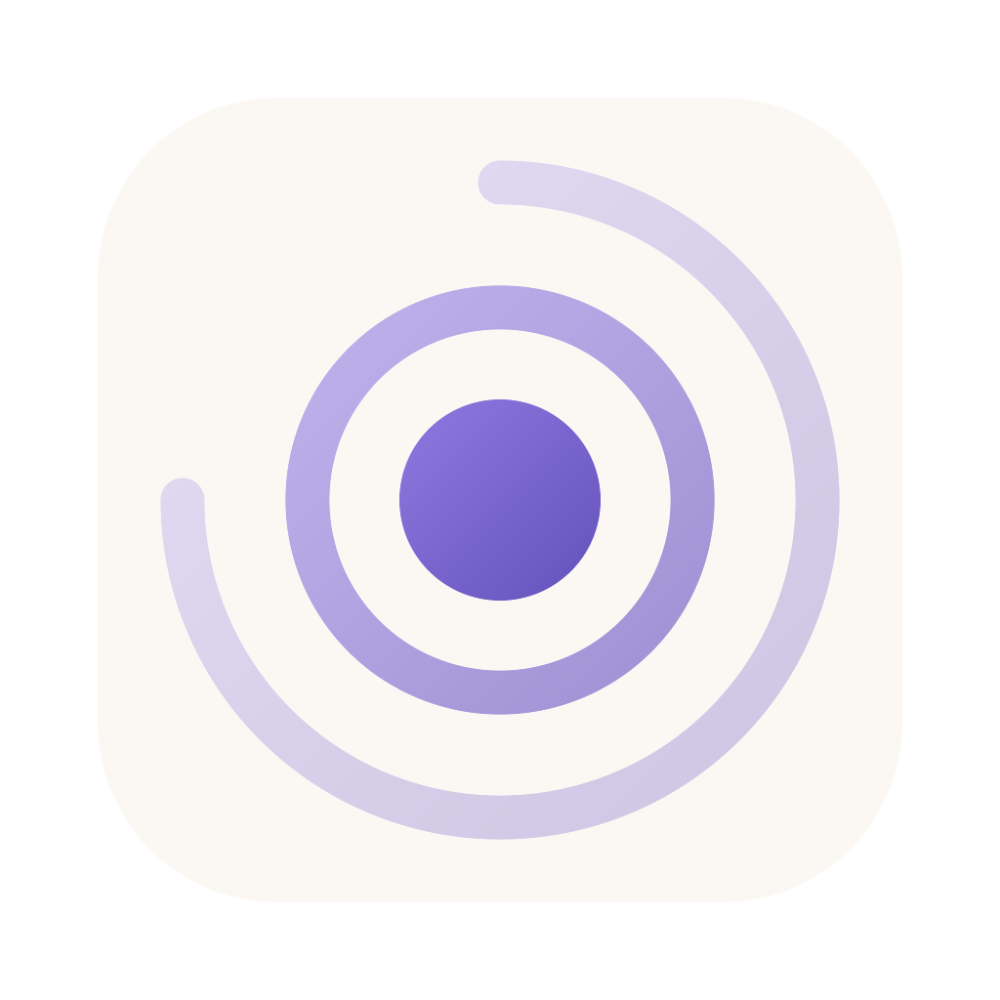

<p align="center">
  
</p>

<h1 align="center">ClaudeRipple</h1>

<p align="center"><a href="README.md">English</a> · <a href="README.ko.md">한국어</a> · <a href="README.zh-CN.md">简体中文</a> · <b>日本語</b> · <a href="README.es.md">Español</a> · <a href="README.pt-BR.md">Português (BR)</a></p>

<p align="center">
  <b>チャットはClaudeのまま。CodeだけをGPTに。</b><br>
  Claude Desktop標準の他モデル設定は<b>アプリ全体</b>を切り替えるため、チャットも、スマホからのRemote Controlも、コネクタも使えなくなります。<br>
  ClaudeRippleは何もオフにしません。Claudeのサブスクリプションにログインしたまま、<b>Codeタブ</b>ではGPT、DeepSeek、Kimi、Grok<br>
  のほか、400以上のモデルが応答します。<b>Codexアプリ</b>と<b>Codex CLI</b>でClaudeを使うこともできます。
</p>

<p align="center">
  <a href="https://www.npmjs.com/package/clauderipple"></a>
  
  <a href="LICENSE"></a>
  
  
  
  
  <a href="README.md"></a>
</p>

<p align="center">
  
</p>

<table align="center">
  <tr>
    <td align="center" width="34%"><br><sub>Claude DesktopのピッカーにGPTモデルが実際の名前で並ぶ</sub></td>
    <td align="center" width="66%"><br><sub>選んだ推論強度で、Codeタブから応答するGPT-5.6 Luna</sub></td>
  </tr>
  <tr>
    <td colspan="2" align="center"><br><sub>GPT-5.6 TerraとSolで動くサブエージェント。バックグラウンドタスクパネルにモデル名が表示される</sub></td>
  </tr>
</table>

---

## 3Pではなく1P — このプロジェクトが存在する理由

Claude Desktopには、他のモデルを使うための公式の方法がすでに用意されています。**推論ゲートウェイ**（inference gateway）設定、つまりアプリ内でサードパーティ（**3P**）モードと呼ばれているものです。これをオンにするのは、セッション単位の選択ではありません。起動時に**アプリ全体**が別のデプロイメントモードに切り替わり、そのモードは別の製品です。

- ウィンドウは`claude.ai`を読み込まなくなり、代わりにローカルのバンドルを読み込みます。claude.aiの`/api/`と`/v1/`への呼び出しは`custom_3p_not_available`の503を返します。
- 「チャット」はもうclaude.aiのチャットではありません。Claude Codeのローカルエージェントセッションです。
- Remote Controlとサイドセッションは完全に無効化されます（`shouldEnableSessionsBridge()`がfalseを返します）。
- Anthropic自身のclaude.aiコネクタ、Claude Design、モバイルとの連携、チャット検索も一緒に失われます。

中間の設定はありません。「チャットはClaude、Codeはゲートウェイ」は誰にもできません。1Pモードでは何ひとつゲートウェイを経由しないからです。（以上はすべて、アプリ自身のバンドルを読んで確認したものです。[docs/ARCHITECTURE.md](docs/ARCHITECTURE.md) §2を参照してください。）

**ClaudeRippleはこの設定に一切触れません**。アプリは1PモードのままClaudeのサブスクリプションにログインし続け、Codeタブとそのサブエージェントでは別のモデルが応答します。モデルピッカーには実際の名前で表示され、選んだ推論強度がそのまま使われます。ClaudeアカウントをGPTアカウントと引き換えにするのではありません。1つのアプリで、両方を使い続けられます。

1Pにとどまることで、次の3つが可能になります。ゲートウェイ方式のツールでは、どれも実現できません。

- **スマホからGPTでコーディング**。3PではRemote Controlがオフになります。ここではオンのままなので、スマホからモデルを選んでタスクを送り、コミットが積み上がっていくのを見届けられます。
- **別のモデルが動いている間もコネクタが使える**。3Pはclaude.aiへの呼び出しをスタブに置き換えるため、Anthropic自身のコネクタも使えなくなります。Google Driveのドキュメントを読みつつ、GPTにコードを書かせられます。
- **クラウドセッションとサイドセッション**。3Pでは消えます。ここではそのままです。

Claudeに料金を払っているなら、3Pは選択肢になりません。料金を払っているサブスクリプションの半分を捨てることになるからです。サブスクリプションを維持しながらモデルを選べるのは、この方法だけです。

## よくある質問

### Claude DesktopアプリでGPTを使えますか？

はい。**Codeタブ**とそのサブエージェントで使えます。ClaudeRippleをインストールし、ChatGPT PlusまたはProのサブスクリプションでログインすると、GPT（GPT-6 Sol、Luna、Astra、GPT-5.6 Terraなど）がモデルピッカーに実際の名前で表示され、選んだ推論強度で応答します。アプリ自体は改変せず、別のモードにも切り替えません。通常の**チャット**タブはClaudeのままです。アプリ全体をゲートウェイモードにしない限り、どのツールでもチャットをルーティングすることはできません（[3Pではなく1P](#3pではなく1p--このプロジェクトが存在する理由)を参照）。

### Claude CodeでGPTを使うには？

同じインストールで、ターミナルの`claude` CLIにも対応します。ClaudeRippleはローカルプロキシで、`~/.claude/settings.json`に2行を追加してClaude Codeの接続先にします。そのため、別のモデルが応答している間も、スキル、フック、MCPサーバー、`CLAUDE.md`、サブエージェントはそのまま動きます。

### Claude Desktopの「サードパーティ推論」（ゲートウェイ）設定をオンにする必要はありますか？

いいえ。オンにすべきではありません。この設定はアプリ全体を3Pモードに切り替え、claude.aiの読み込みを止め、チャットをローカルエージェントセッションに置き換え、Remote Controlをオフにします。ClaudeRippleはこの設定に一切触れません。

### claude.aiのチャット、Remote Control、コネクタは使えなくなりますか？

いいえ。アプリはClaudeのサブスクリプションにログインしたままなので、チャット、スマホからのRemote Control、クラウドセッション、Anthropic自身のコネクタはそのまま使えます。それこそが1Pにとどまる意味です。

### Claude自体も引き続き使えますか？

はい。モデルマッピングはモデル名単位です。ある名前をClaudeのままにしておけば、その名前にはClaudeが応答します。ほとんどの人は1〜2個の名前をGPTにマッピングし、残りはそのままにしています。

### OpenAIのAPIキーは必要ですか？

いいえ。Codexを含むChatGPTプランならどれでも使えます。Plus、Pro、Businessのほか、ワークスペース管理者がCodexを有効にしているEnterpriseとEduも対象です。ログインはアプリから行い、APIキーは一切関係しません。プランの使用量上限が適用され、上限に達した後は購入済みのCodexクレジットで引き続き使えます。APIキーが必要なのは、ほかのプロバイダー（DeepSeek、Kimi、GLM、OpenRouter、そのほかAnthropic互換またはOpenAI互換のエンドポイントを持つもの）だけです。

### どのモデルが使えますか？

ChatGPTのサブスクリプション経由でGPTを、OpenRouterまたはプロバイダーのAPIキーを直接使ってDeepSeek、Kimi、GLM、Grok、Qwenのほか400以上のモデルを使えます。Claudeのモデルはこれまでどおり使えます。

### Windowsでも動きますか？

はい。WindowsとmacOSの、arm64とx64で動きます。インストール、ダッシュボード、再起動、アンインストールはWindows 11 arm64で実測しており、x64ランタイムはエミュレーション環境で実測しています。systemdのユーザーセッションがあればLinuxでも動きます。インストール、ルーターを経由したCodeタブのリクエスト、ストリーミング応答中の再起動、アンインストールをUbuntu 24.04 x64とClaude Desktop 2.2553.13で実測済みで、ピッカーモードも同様です。`cli.extraModels`のモデルが、CodeタブのピッカーにClaude自身のモデルと並んで表示されます。

### コードがほかの場所に送られることはありますか？

いいえ。プロキシは自分のマシン上で動きます。リクエストは設定したプロバイダーにだけ送られ、それ以外には送られません。認証情報はホームディレクトリに保存されます。[プライバシー](#プライバシー)を参照してください。

### Claudeアカウントが利用停止になることはありますか？Anthropicの規約に違反しませんか？

ClaudeRippleがClaudeに対して行うことは限定的で、検証も可能です。Claudeに送られるリクエストは、Claude Codeが送ったとおりバイト単位でそのままマシンから出ていき、GPTなどほかのプロバイダーにルーティングされたリクエストはAnthropicには一切届きません。アプリにパッチを当てるのではなく、Claude Codeが企業ネットワーク向けにドキュメント化しているプロキシと証明書の設定（`HTTPS_PROXY`、`NODE_EXTRA_CA_CERTS` — [Enterprise network configuration](https://code.claude.com/docs/en/corporate-proxy)）を使って動作します。アカウントが停止されたという報告は、逆方向のケース、つまりClaudeのサブスクリプションのログインを**別のプログラム**から使った場合のものです。ClaudeRippleにも、その種の機能がオプションで1つあります。Codexの中で、サブスクリプションのログインを使ってClaudeを使う機能です。この使い方にはAnthropicの規約が適用されます。AnthropicのAPIキーを使えば、この規約上の懸念を避けられます。複数のClaudeサブスクリプションをローテーションして使うことも、同様にその規約のもとで、ご自身で判断していただくことになります。アカウントがどう扱われるかを決められるのはAnthropicだけなので、ここに書いたことは何かを保証するものではありません。

### Googleアカウント経由のGeminiはどうですか？

AI StudioのAPIキーはGoogleがサポートしている方法であり、安全な方法です。Googleアカウントでのログイン（Antigravity）は事情が異なります。Googleの[Antigravity利用規約](https://antigravity.google/terms)（第6条）と[Gemini CLIのFAQ](https://geminicli.com/docs/resources/faq/)は、これらの認証情報を別のプログラムから使うことを違反と明記しています。2026年2月、Googleはこの方法で使われていたアカウントを停止し（停止によってGemini CLIとCode Assistも使えなくなりました）、2度目の違反は永久停止になると[表明しています](https://github.com/google-gemini/gemini-cli/discussions/20632)。ClaudeRippleは、ほかのツールも提供していて要望もあったためこのログインを用意していますが、開始前にこの警告を表示し、通信を隠すようなことは一切しません。使う場合は、サブアカウントを使ってください。

### ChatGPTアカウントを複数使えますか？

はい。`clauderipple login`を実行する（またはダッシュボードで **+ ChatGPTアカウントを追加** を押す）たびに、アカウントが1つ追加されます。アカウントが使用量の上限に達すると、同じリクエストが次のアカウントに移り、上限に達したアカウントは制限期間がリセットされるまで休止します。会話はプロンプトキャッシュを保つため、応答したアカウントで続きます。これはClaude DesktopのCodeタブ、Claude Code、そしてCodexアプリとCLIのGPTに適用されます。

### Codexの中でClaudeを使えますか？

はい。`clauderipple codex on`でClaudeRippleがプロバイダーとして追加され、CodexアプリとCLIのモデル一覧にClaudeのモデルがそれぞれの名前で表示されます。応答には、Claude CodeのログインかAnthropicのAPIキーが使われます。[CodexアプリとCodex CLI](#codexアプリとcodex-cli)を参照してください。

### 画像を生成できますか？

はい。ChatGPTのサブスクリプションがあれば、APIキーなしで生成できます。`clauderipple image "a red paper boat" -o boat.png --aspect square`のように実行します。`--ref FILE`で参照画像を、`--transparent`で透明な背景を指定できます。1枚あたり約30秒かかり、解像度と画質はサブスクリプション側が決めます。ClaudeRippleが生成するサブエージェントにも同じ呼び出し方が伝えられているので、サブエージェントも画像を作れます。[Claude Code](#claude-codeターミナルremote-controlサブエージェント)を参照してください。

### Claude Codeの中だとGPTの性能は落ちますか？

Claude Codeのシステムプロンプトとツールの説明はClaude向けに書かれているため、ほかのモデルは別のモデル向けに調整された指示を読むことになり、そのモデル自身のクライアントとは少し違う振る舞いをすることがあります。ClaudeRippleは各モデルに自身の名前と推論強度を伝え、ベンダーが拒否するようなツールスキーマを作り直し、プロバイダーごとに指示を追記できるようにしています。よくある構成は、Claudeをメインモデルにして、GPTやDeepSeekをサブエージェントにするものです。

### CC Switch、opencodex、claude-code-routerとは何が違いますか？

[比較表](#4つのツールを1つに)を参照してください。要するに、ClaudeRippleはアプリがClaudeにログインしたままの状態でClaude **Desktop**のCodeタブに届き、ほかのモデルをピッカーに実際の名前で表示します。CC Switchもデスクトップアプリに届きますが、ゲートウェイ（3P）モードをオンにする方法によるものです。

### 無料ですか？

はい。ClaudeRippleはGPL-3.0のオープンソースです。費用は、すでに使っているサブスクリプションやAPIキーの分だけです。

## 4つのツールを1つに

似たツールはClaude Code CLIやCodex CLIでほかのモデルを使えるようにしますが、Claudeの**デスクトップアプリ**には届かないか、ゲートウェイ（3P）モード経由でしか届きません。そしてモデルを切り替えた瞬間に、Claudeサブスクリプション側の機能（claude.aiのチャット、Remote Control、クラウドセッション）を失います。ClaudeRippleはデスクトップアプリ、ターミナル、Codexを1つのメニューバーアプリでカバーし、2つのサブスクリプションを並行して使え、Claude Codeのハーネスをそのまま保ちます。別のモデルが思考を担っている間も、スキル、フック、MCPサーバー、`CLAUDE.md`、サブエージェント、claude.aiのコネクタはそのまま動きます。

| | ClaudeRipple | CC Switch（2026-09-24確認） | opencodex / openclaude（2026-09-16確認） | claude-code-router | Claude Desktopのゲートウェイ（3P）モード |
|---|---|---|---|---|---|
| ゲートウェイ（3P）モード**なし**でClaude **Desktop**のCodeタブ | ✅ | ❌ ² | ❌ ¹ | ❌ | ❌ 定義上不可 |
| claude.aiのチャット、Remote Control、クラウドセッション、コネクタを維持 | ✅ | ❌ | ❌ | ❌ | ❌ |
| ClaudeとGPTのサブスクリプションを並行利用 | ✅ | ❌ 一度に1プロバイダー | ❌ 全面的な切り替えのみ | ❌ | ❌ |
| Desktopのピッカーに実際のモデル名 | ✅ | ❌ `claude-*`のロール名 ² | ❌ | ❌ | 一部 |
| 複数のChatGPTアカウント、上限で自動切り替え（DesktopとCodex） | ✅ | ❌ 手動で切り替え ³ | ✅ | ❌ | ❌ |
| ターミナルの`claude` CLI | ✅ | ✅ | ✅ | ✅ | ✅ |
| Codex **アプリ**とCodex CLI → Claude | ✅ | ✅ | ✅ | ❌ | ❌ |
| 変換を挟むプロバイダーでのプロンプトキャッシュ | 実測 **94–99 %** | 未測定 | 未測定 | まちまち | 該当なし |
| タスクパネルでサブエージェントを実際のモデル名で表示 | ✅ | ❌ | ❌ | ❌ | ❌ |
| ターミナル不要の設定GUI | ✅ | ✅ | ❌ | ❌ | ❌ |
| 署名・公証済み、独自ランタイム同梱のアプリ | ✅ | ✅ | ❌ | ❌ | – |

¹ opencodexのREADMEではデモにClaude Desktopが登場していましたが、そのセットアップ手順はリポジトリにもドキュメントサイトにも公開されていませんでした（2026-09-16確認）。当時、デスクトップアプリに入る公開された方法は公式のゲートウェイ設定、つまり表の最後の列だけでした。

² CC Switchは、アプリのサードパーティプロファイル（`Claude-3p/claude_desktop_config.json`、`"inferenceProvider": "gateway"`）を書き込むことでClaude Desktopに届きます。これは表の最後の列と同じ方法です。CC Switchのローカルゲートウェイを通すと、ピッカーには`claude-sonnet-*`、`claude-opus-*`、`claude-haiku-*`のロール名しか表示されません（[CC Switchのマニュアル](https://github.com/farion1231/cc-switch/blob/main/docs/user-manual/en/2-providers/2.6-claude-desktop.md)）。CC Switchはこの表で扱う以上のツール（Gemini CLI、OpenCodeなど）を管理し、それらの間でMCPサーバーとスキルを同期します。

³ ChatGPTアカウントはそれぞれ専用のプロバイダーカードに紐付けられ、公式のChatGPTカードはフェイルオーバーの対象から外されています（v3.20.0のリリースノート）。

デスクトップアプリ自身の「サードパーティ推論」設定は、アプリ全体を別のモードに切り替えます。claude.aiのチャット、Remote Control、クラウドセッションは失われます。`ANTHROPIC_BASE_URL`を置き換えるツールはデスクトップアプリには届かず、届くツールはまさにその設定を書き込みます。ClaudeRippleはそうではなく、Claude Codeのプロセスだけが信頼する小さなHTTPSプロキシです。マッピングしたモデルへのリクエストはプロバイダーへ、それ以外はすべてバイト単位でそのままAnthropicへ送られます。

## できること

- **Claude DesktopとClaude Codeで、あらゆるモデルを**。ChatGPT Plus/Proのサブスクリプションで使えるGPT-6 Sol / Luna / AstraとGPT-5.6 Terra / Sol / Luna（OpenAIが新しいモデルを提供したその日に表示されます）、Google Gemini、あるいはDeepSeek、Kimi、GLM、MiniMax、Qwen、Grok、Mistral、Groq、Together、Fireworks、OpenRouter（400以上のモデル）、ローカルのOllama / LM Studio。ピッカーに実際の名前で表示することも、Claudeの名前にマッピングすることもできます。
- **CodexアプリとCodex CLIでClaudeを**。Codexがプロバイダーとして扱うローカルのOpenAI互換エンドポイントです。ClaudeのモデルがCodex自身のモデル一覧に表示されます。現在のClaude CodeのログインかAnthropicのAPIキーを使います。
- **プロンプトキャッシュを壊さずに複数のClaudeアカウントを使う**。ネイティブのClaudeプロバイダーでアカウントローテーションを有効にし、ダッシュボードからサブスクリプションを追加すると、各会話は応答したアカウントで続きます。応答が始まる前にクォータや認証で拒否された場合、そのターンは次のアカウントに移ります。このネイティブなClaude Desktop/Codeの経路は、変換を挟むCodex向けの受信エンドポイントとは別物です。Codex側は利用可能なログインを1つ選んで使い、アカウントのローテーションはしません。
- **複数のChatGPTアカウント**。`clauderipple login`を実行する（またはダッシュボードで **+ ChatGPTアカウントを追加** を押す）たびに1つ追加されます。アカウントが上限に達すると、同じリクエストを次のアカウントが引き継ぎ、上限に達したアカウントは制限期間がリセットされるまで休止します。会話はキャッシュを保つため、応答したアカウントで続きます。対象はClaude DesktopのCodeタブとサブエージェント、**そしてCodexアプリとCLIのGPT**です。Codexは自身のログインを保ったまま、ログアウトせずに次のアカウントへ移ります。
- **Claude Codeのハーネスには手を加えません**。スキル、フック、MCP、`CLAUDE.md`、サブエージェント、プランモード、スマホからのRemote Control。何もオフになりません。
- **設計段階で正しさを確保**。プロンプトキャッシュを保持（Anthropicのキャッシュブレークポイントと、安定したOpenAIのプレフィックス）、Claude Codeのサーバー側スレッドを処理、ツール呼び出しと画像を往復で変換、推論強度を各モデルが受け付ける範囲に調整、互換ベンダー向けにはAnthropic専用のリクエストフィールドを除去。
- **本物のリクエストログ**。誰が依頼し、どのモデルが応答したか、入力 / キャッシュ / 出力のトークン数、レイテンシ、ステータスをリクエストごとに記録し、直近1時間のサマリーも表示します。
- **サブエージェントの名前タグ**。バックグラウンドタスクパネルに、汎用の「Agent」ではなく`Terra·high · Review`のように表示されます。
- **入力する場所にルートを表示**。Claude Codeのmodがプロンプトの上に1行を表示します。直前のリクエストの行き先、推論強度、キャッシュヒット率、所要時間です。`Log`（または`/ripple-log`）でリクエストログをサイドペインに開き、プロバイダーと結果ごとに色分けして表示します。`×`（または`/ripple-bar`）でこの行を隠せます。同じmodは、Agent呼び出しで別のモデルが指定されてもワーカーを自分のモデルのまま動かし、`[[ripple: name@level]]`マーカーがプロンプトのどこにあっても読み取ります。「クライアント」画面のスイッチ1つ、または`clauderipple mod on`で有効にできます。
- **ChatGPTのサブスクリプションで画像を生成**。`clauderipple image "<prompt>"`で、参照画像や透明背景にも対応します。サブエージェントにもやり方が伝えられているので、GPTやDeepSeekのワーカーでも、画像ツールなしで画像を作って確認できます。
- **必要なら軽量なワーカーを**。スイッチ1つで、生成されるサブエージェントに、セッションのすべてのMCPサーバーとプラグインではなく、ワーカーが使うツールだけを渡します。あるワーカーの最初のリクエストは33kトークンから9kトークンに減りました。
- **ターミナルを使いたくない人のために**。ワンクリックの接続テストとモデル検出付きのプロバイダープリセット、ドロップダウンによるモデルマッピング、自動保存、韓国語と英語のUI。独自のランタイムを同梱し、初回起動時に自らセットアップするメニューバーアプリ。署名・公証済みです。

<p align="center">
  
</p>

## インストール

**macOS**

```sh
curl -fsSL https://raw.githubusercontent.com/PBJ-2/clauderipple/main/scripts/install.sh | sh
```

**Windows**（PowerShell）

```powershell
irm https://raw.githubusercontent.com/PBJ-2/clauderipple/main/scripts/install.ps1 | iex
```

**Linux**（systemdのあるデスクトップセッション）

```sh
curl -fsSL https://raw.githubusercontent.com/PBJ-2/clauderipple/main/scripts/install.sh | sh
```

ルーターはユーザー単位のsystemdサービスとして動きます。状態は`systemctl --user status clauderipple`で、出力内容は`journalctl --user -u clauderipple`で確認できます。ピッカーモードでは、Chromiumが読むNSSデータベース（`~/.pki/nssdb`。自分のユーザーのみ、sudo不要）でローカルCAを信頼させるため、`certutil`が必要です。`clauderipple picker on`の前に`sudo apt install libnss3-tools`（Fedoraでは`sudo dnf install nss-tools`）を実行してください。

前提条件はこれだけです。スクリプトはインストール済みのNode 24以上があればそれを使い、なければ公式ビルドを`~/.clauderipple/runtime`にダウンロードして、nodejs.orgが公開しているチェックサムで検証します。続いてClaudeRippleをセットアップします。ローカル証明書の作成、`~/.claude/settings.json`への2行の追加、そしてコンピューターの起動時に立ち上がるバックグラウンドのルーターの登録です。管理者権限もパスワードも不要です。

Nodeがすでにインストールされていれば、スクリプトを使わずに済みます。

```sh
npm install -g clauderipple
clauderipple install
```

続いてダッシュボードを開き、プロバイダーを追加します。

```sh
clauderipple ui
```

**プロバイダー** → ChatGPTを追加するかAPIキーを貼り付け → **モデルマッピング**。

**メニューバー / トレイアプリ**は任意です。ルーターの状態を表示し、ワンクリックでダッシュボードを開けます。

```sh
clauderipple tray
```

Electronで動作し、約270MBあるため、デフォルトではインストールされません。`clauderipple tray --install`で一度だけ取得します。それ以外の機能はすべてElectronなしで動きます。

**アップデート**。新しいバージョンがあればトレイから案内されます（**アップデートを確認…**）。または次のコマンドを実行します。

```sh
clauderipple update
```

インストールしたときと同じ方法（インストールスクリプトかnpm）でアップデートし、ルーターを新しいバージョンで再起動します。トレイのElectronはアップデート後も保持されます。

任意：Desktopのピッカーに実際の名前を表示するには、**クライアント → Claude Desktop → モデルピッカー → オン**にしてから、Claude Desktopを終了して開き直します。ローカル証明書を自分のユーザーに限って信頼させるため、macOSではログインパスワードを求められ、Windowsではフィンガープリント付きの確認ダイアログが表示されます。Linuxでは確認なしでNSSデータベースに追加されます。ClaudeRippleがパスワードを見ることはなく、どのプラットフォームでも管理者権限は不要です。

> **Claude Desktopのウィンドウを閉じるだけでは不十分です**。アプリは動き続けており、次に起動したときは新しい設定を読まずにそのプロセスを再利用します。きちんと終了してください（macOS：⌘Q、Windows：トレイアイコンまたはタスクマネージャー、Linux：Ctrl+Qまたはトレイアイコン。`pgrep -f claude-desktop`が何も出力しなくなるまで）。そうしないと、ピッカーは何のエラーも出さずに変わらないままです。

<details>
<summary>ソースから（Node 24）</summary>

```bash
git clone https://github.com/PBJ-2/clauderipple && cd clauderipple && npm install
node packages/cli/src/index.ts install   # certs, settings.json env, supervisor (launchd / Task Scheduler), end-to-end probe
node packages/cli/src/index.ts ui        # open the local GUI in your browser
```

`uninstall`はすべてを元に戻し、`~/.claude/settings.json`をバックアップから復元します。そのほかのコマンド：`status`、`start`、`stop`、`restart`、`logs -f`、`login`、`logout`、`claude-login`、`claude-logout`、`picker on|off`、`agent-title on|off`、`mod on|off`、`codex on|off`、`update`、`image "<prompt>"`。
</details>

## クライアント

### Claude Desktop

インストール後すぐに使えます。**モデルマッピング**でモデルをマッピングするか（自動保存）、**ピッカーモード**をオンにして、アプリ自身のピッカーにプロバイダーのモデルを名前で表示します。アプリで選んだ推論強度はそのまま渡され、対応していないレベルは受け付けられる範囲に調整されます。

### Claude Code（ターミナル、Remote Control、サブエージェント）

ルーターもマッピングも同じです。`/model gpt-5.6-terra`で、追加したモデルが一覧に表示されます。サブエージェントもルーティングに従います。サブエージェントのプロンプトに`[[gpt: sol@xhigh]]`マーカーを入れると、その呼び出しだけモデルを上書きでき、タスクパネルには実際のモデル名が表示されます。

**このためにエージェントハーネスを自作する必要はありません**。サブエージェントのスロットをルーティング先のモデルに向けるだけで、すべてのサブエージェントがそのモデルで動きます。エージェントファイルも、ほかの設定も不要です。

```jsonc
// Settings → CLI models, or "cli": { "models": { … } } in the config
{ "subagent": "gpt-5.6-terra" }   // → CLAUDE_CODE_SUBAGENT_MODEL
```

**チェックしたモデルは、そのまま名前付きのサブエージェントにもなります**。ルーターは、1つのプロバイダーだけが提供しているモデルごとに`~/.claude/agents/<name>.md`を書き出します（`gpt-5.6-terra` → `gpt-5-6-terra`、`deepseek-v4.1-flash` → `deepseek-v4-1-flash`）。そのため「DeepSeekにやらせて」に必要なのは、モデルにチェックを入れることだけです。Agentツールの一覧に表示され、`subagent_type: "deepseek-v4-1-flash"`で実行でき、タスクパネルにその名前が表示されます。チェックを外すと、そのファイルは消えます。ルーターが触れるのは自分で書き出したファイル（`generated-agents.json`に記録）だけです。同じ名前で自分で書いたエージェントファイルがあればそちらが優先され、手を加えられることはありません。つまりカスタムの指示を与えたい場合も、ルーターが認識できる`model:`を書いた、Claude Code標準のエージェントファイルを用意するだけです。

```markdown
---
name: reviewer
description: Independent review on GPT-5.6 Sol.
model: gpt-5.6-sol@medium
---
You are the reviewer for this session. Verify the change yourself and report
the conclusion only.
```

呼び出しごとの推論強度は、サブエージェントのプロンプトの**1行目**に書きます。`[[ripple: gpt-5-6-terra@high]]` — エージェント名でもモデルIDでも構いません。それ以外の場所にあるマーカーはただの文章とみなされ、無視されます（マーカーを引用したコンパクションの要約が、セッションのルーティングを変えてしまってはいけないためです）。ルーターが行き先を決められないモデルは、どこか分かりにくい場所で失敗するまで送られるのではなく、名前を挙げて拒否されます（`400 ClaudeRipple: no provider declares "…"`）。ネイティブのClaudeモデルは常にそのまま通過します。生成をオフにするには`"cli": { "agentFiles": false }`を設定します。

デフォルトでは、生成されたワーカーはセッションのすべてのツールを継承するため、MCPサーバーやプラグインがワーカーのリクエストごとに含まれます。`"cli": { "limitWorkerTools": true }`（またはダッシュボードの**ワーカーツール**）を使うと、読み取り・編集・実行・検索・スキルのツールだけが渡され、あるワーカーの最初のリクエストは約33kトークンから9kトークンに減りました。このワーカーはブラウザやシミュレーターのツールを持ちません。それらが必要なワーカーには、自分でエージェントファイルを用意してください。そのファイルには一切手が加えられません。

ChatGPTのプロバイダーを設定していれば、同じサブスクリプションで画像を生成できます。

```bash
clauderipple image "a red paper boat, flat illustration" -o boat.png --aspect square
```

`--transparent`、`--format png|jpeg|webp`、`--ref FILE`（参照画像。複数指定可）は任意です。1枚あたり約30秒かかります。サブスクリプションのバックエンドが解像度と画質を自ら決めるため、画像の形は言葉で指定します（`--aspect`）。このコマンドは管理ポートの`POST /api/image`を呼び出すクライアントで、このエンドポイントは画像のバイト列を返します。生成されたワーカーにはその`curl`での呼び出し方が伝えられているので、Bashしか持たないワーカーでも画像を作り、読み込んで確認できます。

Claude Codeは`WebSearch`を小型モデルへの別のリクエストとして実行します。ChatGPTにルーティングした構成でこのリクエストのためにAnthropicのクォータを消費しないようにするには、`config.json`で同じChatGPTプロバイダーを検索のバックエンドに指定します。

```jsonc
{ "webSearch": { "provider": "chatgpt", "model": "gpt-5.6-terra" } }
```

これはオプトインです。`webSearch`の設定がなければ、Claude Codeの既存の検索経路は変わりません。

### CodexアプリとCodex CLI

```bash
clauderipple codex on     # adds a "clauderipple" provider to ~/.codex/config.toml (backup first)
codex --profile clauderipple -m claude-sonnet-5
```

`codex on`は、Codex組み込みのOpenAIプロバイダーの接続先もClaudeRippleに変更します（`openai_base_url`）。CodexはChatGPTのログインを保ち、GPTへのリクエストはそのままChatGPTへ送られます。ただし、使うアカウントはClaudeRippleに追加したものの中から選ばれます。そのため複数追加していれば、Codexも上限に達したアカウントから次のアカウントへ移ります。1つも追加していないか、すべてが上限に達している場合は、Codex自身のログインが使われます。自分で設定した`openai_base_url`には手を加えません。`clauderipple codex off`で元に戻せます。

ClaudeのモデルはCodexのモデル一覧にそれぞれの名前で表示されます（ClaudeRippleがCodex自身のカタログの横にモデルカタログを書き出します）。Claudeへの接続には、Claude Codeのログイン（実行中のDesktopセッションやターミナルでのログインから検出したもの、またはClaudeRipple独自のログイン。後者は**プロバイダー → Claude → + Claudeアカウントを追加** からブラウザで行えるので、ターミナルは不要です。`clauderipple claude-login`と同じです）か、AnthropicのAPIキーを使います。サブスクリプションのログインの再利用には、Anthropicの規約が適用されます。設定済みのAnthropic互換プロバイダーも、同じように使えます。

<p align="center">
  
</p>

## プロバイダー

| プロバイダー | 種類 | 認証 | モデル一覧 | 備考 |
|---|---|---|---|---|
| ChatGPTサブスクリプション | Codexバックエンド | 複数ログイン、上限で自動切り替え（Codexのログインも再利用） | サブスクリプションから取得（GPT-6 Sol、Luna、Astra、GPT-5.6 …） | 推論強度 low…max（Lunaはultra）、プロンプトキャッシュ 94–99 % |
| Google Gemini | Gemini API | AI StudioのAPIキー、またはGoogleアカウントでのログイン（Antigravity、FAQ参照） | 自動検出 | 変換（Messages ⇄ generateContent）、thought signatureをターン間で保持 |
| Grokサブスクリプション | Grok CLIのチャットプロキシ | Grok CLIのログイン（`grok login`）、更新はCLIが行う | サブスクリプションから取得（Grok 4.7、4.7 Fast、4.6、4.5） | 変換（Chat Completions）、推論強度 low…xhigh。公開APIではなくCLI専用の経路（[§4e](docs/ARCHITECTURE.md#4e-grok-providers-implemented-2026-10-08)） |
| OpenRouter | Anthropic互換 | APIキー | 400以上、自動検出 | モデルごとの推論強度への対応をAPIから取得 |
| DeepSeek、Kimi、Z.ai GLM、MiniMax、Qwen（国際版 / 中国版） | Anthropic互換 | APIキー | プリセット | ベンダーのドキュメントで確認済み |
| xAI Grok、Mistral、Groq、Together、Fireworks | OpenAI互換 | APIキー | 自動検出 | 変換（Chat Completions / Responses） |
| Ollama、LM Studio | OpenAI互換、ローカル | なし | 自動検出 | |
| Anthropic | ネイティブ | Claudeのログイン（複数可）またはAPIキー | Claudeモデル | Claude Desktop/Code向けに会話ごとにアカウントを固定するローテーション（任意）、Codexはログインを1つ選択 |
| その他 | カスタム | 任意 | 自動検出 | Anthropic互換またはOpenAI互換の任意のエンドポイント |

互換プロバイダーへのリクエストからはAnthropic専用のフィールド（サーバー側スレッド、遅延ロードされるツール、コンテキスト管理、thinkingのバインディング）を取り除き、推論強度をモデルごとに調整するため、Claude Codeのリクエスト形式に対してベンダーが400エラーを返すことはありません。

## 仕組み

```
Claude Desktop / claude CLI ──HTTPS_PROXY──▶ ClaudeRipple ──▶ api.anthropic.com   (unchanged)
                                               │
                        mapped model ──────────┼──▶ chatgpt.com/backend-api (Responses ⇄ Messages)
                                               ├──▶ Anthropic-compatible vendors (+ compat layer)
                                               ├──▶ OpenAI-compatible vendors (Messages ⇄ Chat/Responses)
                                               └──▶ Google Gemini (Messages ⇄ generateContent)
Codex app / CLI ──/v1/responses──▶ ClaudeRipple ingress ──▶ Claude (your login or API key) / vendors
```

- Claude Code CLIは`~/.claude/settings.json`から`HTTPS_PROXY`と`NODE_EXTRA_CA_CERTS`を読み込みます（Anthropicがドキュメント化している企業プロキシ向けの方法）。ClaudeRippleのローカルCAを信頼するのはこのプロセスだけで、ピッカーモードをオンにしない限り、OSのキーチェーンには触れません。
- ピッカーモードは、アプリ自身のclaude.aiへの通信をプロキシ経由にし、アプリが起動時に取得するピッカーの一覧に自分のモデルを追加します。オフに戻すのもワンクリックです。
- ルーターは再起動時に処理中の呼び出しを最後まで処理し、上流での失敗が繰り返されると自ら終了してlaunchdに再起動させ、ログをローテーションし、リクエストを黙って取りこぼすことはありません。

出典付きの詳細：[docs/ARCHITECTURE.md](docs/ARCHITECTURE.md)

## プライバシー

すべて127.0.0.1上で動きます。APIキーは`~/.clauderipple/config.json`に、追加したClaudeのOAuthグラントは`~/.clauderipple/claude-accounts.json`に保存されます（どちらもパーミッション0600）。管理APIとログには、トークンも上流のアカウントIDも出力されません。通信先は、自分で設定したプロバイダーだけです。テレメトリーはありません。

## 現状：アルファ版

作者が日常的に使っていますが、まだ開発初期のプロジェクトです。粗削りな部分もあります。

- **Windows対応は新しく追加されたばかりです（2026-09-14）**。インストール、セットアップ、ルーター、ログイン、ピッカー、実際のGPT呼び出しはx64の実機で検証済みで、クラッシュからの復旧はarm64で検証済みです。ウィンドウはまだWindows標準のタイトルバーのままです。Windowsビルドは署名されていません。「インストール」の注記を参照してください。
- **Linux対応も新しく追加されたばかりです（2026-09-24）**。Ubuntu 24.04 x64での実測結果（インストール、Codeタブのリクエスト、ストリーミング中の再起動、ピッカーモード、アンインストール）とともにコントリビュートされました。systemdのユーザーセッションが必要です。ほかのディストリビューションとarm64は未検証です。
- ChatGPT、OpenRouter、Codex内のClaudeは実際のアカウントで検証済みです。そのほかのプリセットは各ベンダーの公式ドキュメントに従っています。
- ピッカーに追加したモデルは、次のセッションから使えます。
- Claude CodeとCodexは通信プロトコルを頻繁に変更します。クライアントのアップデートにより、ClaudeRippleが追従するまで変換が動かなくなることがあります。バグ報告やログを歓迎します。

## 提携関係について

ClaudeRippleは独立したオープンソースプロジェクトです。AnthropicおよびOpenAIとは提携関係になく、両社による承認や後援も受けていません。ClaudeおよびClaude Codeは、Anthropic, PBCの商標です。ChatGPTおよびCodexは、OpenAIの商標です。

## ライセンス

Copyright (c) 2026 pbj. GPL-3.0 — [LICENSE](LICENSE)を参照してください。自由に使えます。改変したものを配布する場合は、そのソースコードも同じライセンスで公開してください。
