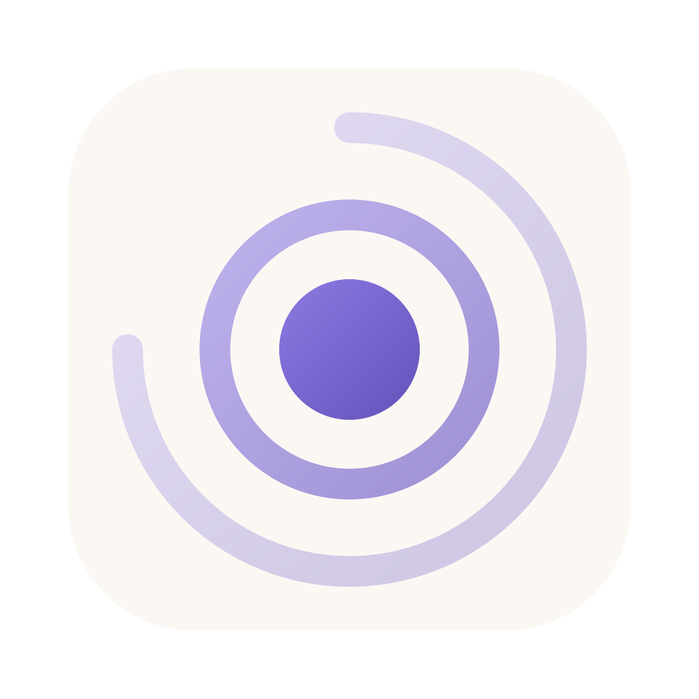
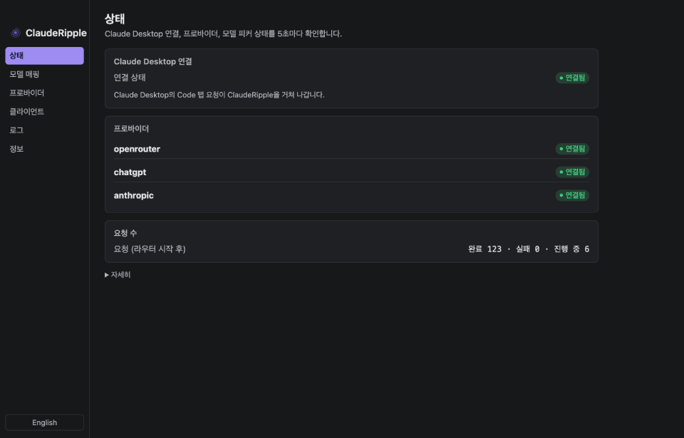
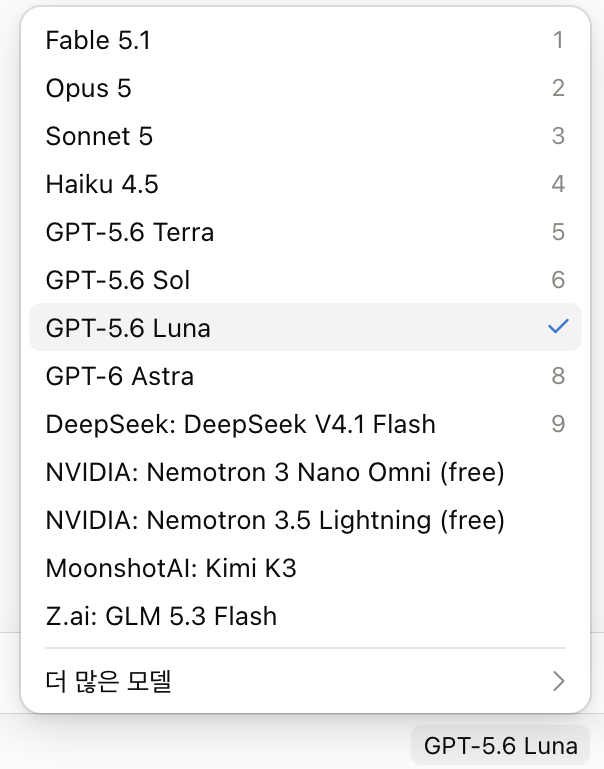
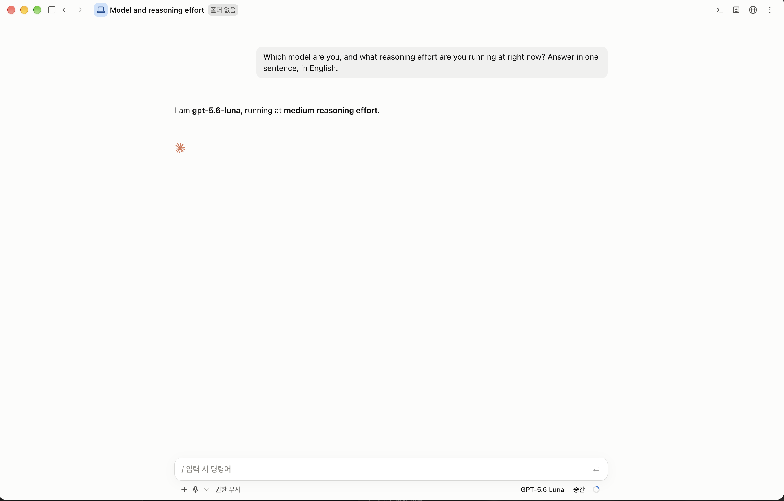
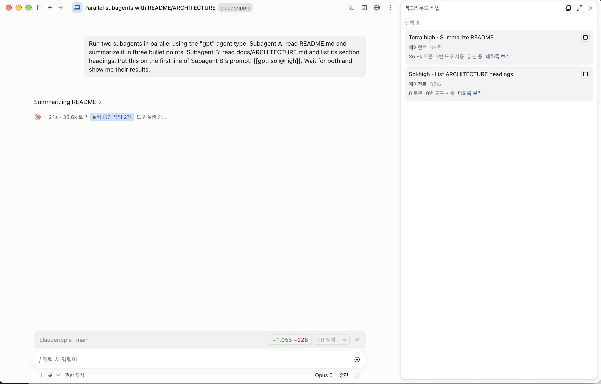
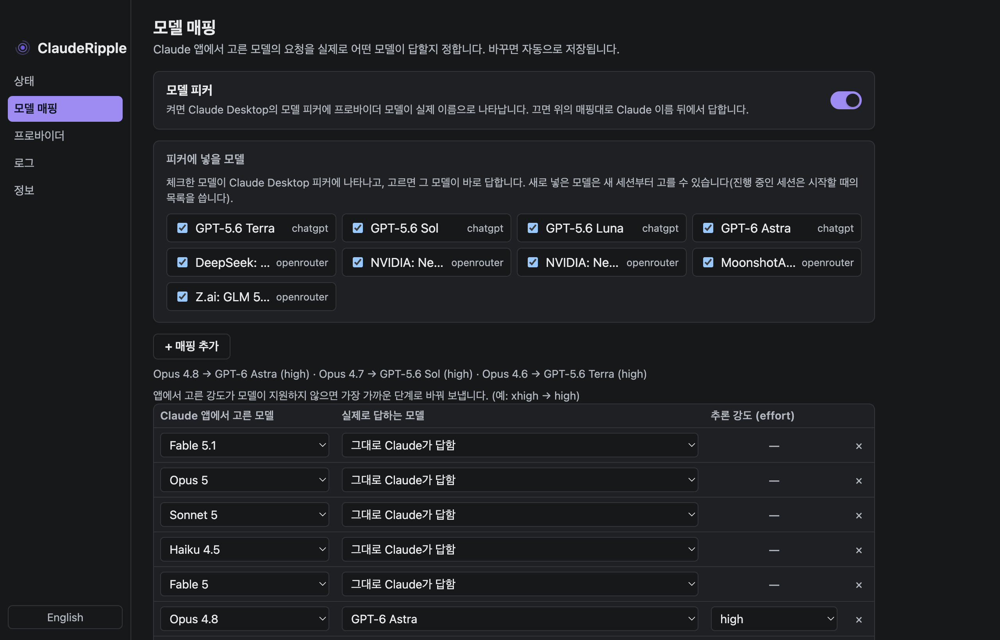
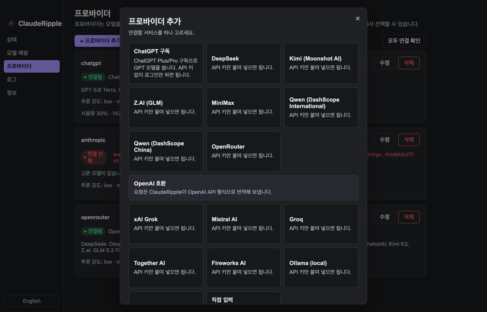

<p align="center">
  
</p>

<h1 align="center">ClaudeRipple</h1>

<p align="center"><a href="README.md">English</a> · <b>한국어</b></p>

<p align="center">
  <b>어떤 모델이든, 어떤 AI 코딩 도구에서든. 아무것도 포기하지 않고.</b><br>
  <b>Claude Desktop</b>과 <b>Claude Code</b> 안에서 GPT·DeepSeek·Kimi·Grok 등 400개 넘는 모델을 쓰고,<br>
  <b>Codex 앱</b>과 <b>Codex CLI</b> 안에서 Claude를 씁니다. 로컬 프록시 하나, 메뉴 막대 앱 하나.
</p>

<p align="center">
  <a href="https://github.com/PBJ-2/clauderipple/releases"></a>
  
  <a href="LICENSE"></a>
  
  
  
  <a href="README.md"></a>
</p>

<p align="center">
  
</p>

<table align="center">
  <tr>
    <td align="center" width="34%"><br><sub>Claude Desktop 피커에 GPT 모델이 실제 이름으로</sub></td>
    <td align="center" width="66%"><br><sub>Code 탭에서 고른 추론 강도 그대로 답하는 GPT-5.6 Luna</sub></td>
  </tr>
  <tr>
    <td colspan="2" align="center"><br><sub>GPT-5.6 Terra·Sol로 도는 서브에이전트, 작업 패널에 실제 이름으로</sub></td>
  </tr>
</table>

---

## 네 개 대신 하나

비슷한 도구들은 터미널용입니다. Claude Code CLI나 Codex CLI가 다른 모델을 쓰게는 해 주지만, Claude **데스크톱 앱**에는
닿지 못하고, 다른 모델로 바꾸는 순간 Claude 구독 쪽 기능(claude.ai 채팅, Remote Control, 클라우드 세션)을 잃습니다.
ClaudeRipple은 데스크톱 앱·터미널·Codex를 메뉴 막대 앱 하나로 다루고, 두 구독을 나란히 쓰며, Claude Code 하네스를
그대로 둡니다. 스킬·훅·MCP 서버·`CLAUDE.md`·서브에이전트·claude.ai 커넥터가 전부 살아 있는 채로 두뇌만 바뀝니다.

| | ClaudeRipple | opencodex / openclaude | claude-code-router | Claude Desktop "3P" 설정 |
|---|---|---|---|---|
| Claude **Desktop** Code 탭 | ✅ | ❌ | ❌ | ✅ |
| claude.ai 채팅·Remote Control·클라우드 세션 유지 | ✅ | ❌ | ❌ | ❌ |
| Claude 구독과 GPT 구독 나란히 | ✅ | ❌ 전부 아니면 전무 | ❌ | ❌ |
| Desktop 피커에 실제 모델 이름 | ✅ | ❌ | ❌ | 일부 |
| 터미널 `claude` CLI | ✅ | ✅ | ✅ | ✅ |
| Codex **앱**·Codex CLI → Claude | ✅ | ✅ | ❌ | ❌ |
| 번역 프로바이더의 프롬프트 캐시 | **94~99 %** 실측 | 12~20 % 실측 | 제각각 | 해당 없음 |
| 서브에이전트를 실제 모델 이름으로 표시 | ✅ | ❌ | ❌ | ❌ |
| 터미널 없이 쓰는 설정 GUI | ✅ | ❌ | ❌ | ❌ |
| 런타임 내장, 서명·공증된 앱 | ✅ | ❌ | ❌ | – |

데스크톱 앱의 "서드파티 추론" 설정은 앱 전체를 다른 모드로 바꿔 버립니다. claude.ai 채팅, Remote Control,
클라우드 세션을 잃습니다. `ANTHROPIC_BASE_URL`을 바꿔치기하는 도구들은 데스크톱 앱에 아예 닿지 못합니다.
ClaudeRipple은 Claude Code 프로세스만 신뢰하는 작은 HTTPS 프록시입니다. 매핑한 모델 요청만 프로바이더로 가고,
나머지는 Anthropic으로 바이트 그대로 지나갑니다.

## 할 수 있는 것

- **Claude Desktop과 Claude Code에서 어떤 모델이든.** ChatGPT Plus/Pro 구독으로 GPT-5.6 Terra / Sol / Luna와
  GPT-6 Astra를, 아니면 DeepSeek·Kimi·GLM·MiniMax·Qwen·Grok·Mistral·Groq·Together·Fireworks·OpenRouter(400+ 모델)·
  로컬 Ollama / LM Studio를. 피커에 실제 이름으로 띄우거나, Claude 이름에 매핑해서.
- **Codex 앱과 Codex CLI에서 Claude를.** Codex가 프로바이더로 인식하는 로컬 OpenAI 호환 엔드포인트. Claude 모델이
  Codex 자체 모델 목록에 뜹니다. Claude Code 로그인이나 Anthropic API 키를 씁니다.
- **Claude Code 하네스는 손대지 않습니다.** 스킬, 훅, MCP, `CLAUDE.md`, 서브에이전트, 플랜 모드, 휴대폰 Remote Control.
  아무것도 꺼지지 않습니다.
- **구조적으로 올바르게.** 프롬프트 캐시 보존(Anthropic 캐시 브레이크포인트, 고정된 OpenAI 프리픽스), Claude Code의
  서버 측 스레드 처리, 도구 호출과 이미지 왕복, 모델이 받는 범위로 추론 강도 클램프, 호환 벤더에는 Anthropic 전용 필드 제거.
- **제대로 된 요청 로그.** 누가 물었고 어떤 모델이 답했는지, 입력·캐시·출력 토큰, 지연, 상태를 요청마다. 한 시간 요약 포함.
- **서브에이전트 이름표.** 백그라운드 작업 패널에 "Agent" 대신 `Terra·high · Review`가 보입니다.
- **터미널이 싫은 사람을 위해.** 원클릭 연결 확인과 모델 자동 검색이 붙은 프로바이더 프리셋, 드롭다운 모델 매핑, 자동 저장,
  한국어·영어 UI. 런타임을 품고 첫 실행에 스스로 설치하는 메뉴 막대 앱. 서명·공증 완료.

<p align="center">
  
</p>

## 설치

*아직 릴리스가 없습니다. 첫 빌드를 마무리하는 중이며, 그때까지는 아래 소스 설치를 쓰십시오. 같은 코드입니다.*

**macOS.** [Releases](https://github.com/PBJ-2/clauderipple/releases)에서 `ClaudeRipple-<버전>-arm64.dmg`(Apple Silicon)
또는 `-x64.dmg`(Intel)를 받아 Applications로 끌어다 놓고 엽니다.

**Windows (x64).** `ClaudeRipple-Setup-<버전>-x64.exe`를 받아 실행합니다(사용자 단위 설치, 관리자 권한 불필요).
ClaudeRipple이 돌고 있는 상태에서 재설치해도 됩니다. 설치 관리자가 먼저 라우터를 정상 종료합니다.
`ClaudeRipple-<버전>-win-x64.zip`은 같은 빌드를 풀어 놓은 것이니 그쪽이 편하면 그것을 쓰십시오.
**arm64 Windows**는 `-arm64.zip`을 쓰십시오. arm64 설치 관리자는 고장 나 있습니다(아래 참고).

> **Windows에서 "PC를 보호했습니다" 경고가 뜹니다.** 코드 서명을 하지 않았기 때문입니다. 서명 인증서는 연
> 219~685달러이고 하드웨어 토큰까지 필요해서, 이 프로젝트는 거기에 돈을 쓰지 않습니다. **추가 정보 → 실행**을
> 누르십시오. 꺼림칙하시면 소스로 직접 빌드하셔도 결과는 같습니다.

> **arm64 설치 관리자는 고장 나 있습니다.** Windows 11 arm64에서 실행 파일만 빼고 설치하면서 성공했다고
> 보고합니다(그래서 앱이 안 켜집니다). arm64 zip에는 이 문제가 없습니다. x64 설치 관리자는 실기에서 검증했습니다.

첫 실행에 설치를 제안합니다. 로컬 인증서, `~/.claude/settings.json` 두 줄, 로그인 시 자동 시작하는 백그라운드
라우터. Node 설치는 필요 없습니다. 그다음 트레이 아이콘 → **ClaudeRipple 열기…** → **프로바이더** → ChatGPT 추가
또는 API 키 붙여 넣기 → **모델 매핑**.

선택 사항, Desktop 피커에 실제 이름을 띄우려면: **클라이언트 → Claude Desktop → 모델 피커 → 켜기**. 그다음 Claude
Desktop을 완전히 종료했다가 다시 엽니다. 로컬 인증서를 사용자 범위로만 신뢰시키는데, 이때 macOS는 로그인 암호를
묻고 Windows는 지문이 적힌 확인 창을 띄웁니다. ClaudeRipple은 암호를 보지 않으며, 양쪽 다 관리자 권한이 필요
없습니다.

> **Claude Desktop은 창을 닫아도 종료되지 않습니다.** 그 상태로 다시 열면 이전 인스턴스를 재사용해서 새 설정을
> 읽지 않습니다. 제대로 종료하십시오(macOS는 ⌘Q, Windows는 트레이 아이콘 또는 작업 관리자). 안 그러면 피커가
> 아무 말 없이 그대로입니다.

<details>
<summary>소스에서 (Node 24)</summary>

```bash
git clone https://github.com/PBJ-2/clauderipple && cd clauderipple && npm install
node packages/cli/src/index.ts install   # 인증서, settings.json 환경, launchd 에이전트, 엔드투엔드 점검
node packages/cli/src/index.ts ui        # 브라우저에서 로컬 GUI 열기
```

`uninstall`은 전부 되돌리고 `~/.claude/settings.json`을 백업에서 복원합니다. 그 밖의 명령: `status`, `start`, `stop`,
`restart`, `logs -f`, `login`, `logout`, `claude-login`, `claude-logout`, `picker on|off`, `agent-title on|off`,
`codex on|off`.
</details>

## 클라이언트

### Claude Desktop

설치 후 바로 됩니다. **모델 매핑**에서 매핑하거나(자동 저장), **피커 모드**를 켜서 앱 자체 피커에 프로바이더 모델을
실제 이름으로 띄웁니다. 앱에서 고른 추론 강도는 그대로 전달되고, 모델이 못 받는 강도는 가장 가까운 값으로 맞춥니다.

### Claude Code (터미널, Remote Control, 서브에이전트)

같은 라우터, 같은 매핑. `/model gpt-5.6-terra`에 추가한 모델이 나열됩니다. 서브에이전트도 같은 라우팅을 따르고,
프롬프트에 `[[gpt: sol@xhigh]]` 표식을 넣으면 그 호출만 모델을 바꿉니다. 작업 패널에는 실제 모델 이름이 보입니다.

### Codex 앱과 Codex CLI

```bash
clauderipple codex on     # ~/.codex/config.toml에 "clauderipple" 프로바이더 추가(백업 먼저)
codex --profile clauderipple -m claude-sonnet-5
```

Claude 모델이 Codex 모델 목록에 이름 그대로 뜹니다(ClaudeRipple이 Codex 자체 카탈로그 옆에 모델 카탈로그를 씁니다).
Claude는 Claude Code 로그인(실행 중인 Desktop 세션, 터미널 로그인, 또는 `clauderipple claude-login`으로 만든 것)이나
Anthropic API 키로 갑니다. 구독 로그인 재사용은 Anthropic 약관의 적용을 받습니다. 설정한 Anthropic 호환 프로바이더도
같은 방식으로 쓸 수 있습니다.

<p align="center">
  
</p>

## 프로바이더

| 프로바이더 | 종류 | 인증 | 모델 목록 | 비고 |
|---|---|---|---|---|
| ChatGPT 구독 | Codex 백엔드 | 로그인(또는 Codex 로그인 재사용) | Terra, Sol, Luna, Astra | 추론 강도 low…max(Luna는 ultra), 프롬프트 캐시 94~99 % |
| OpenRouter | Anthropic 호환 | API 키 | 400+, 자동 검색 | 모델별 추론 강도 지원을 API에서 읽음 |
| DeepSeek, Kimi, Z.ai GLM, MiniMax, Qwen(국제/중국) | Anthropic 호환 | API 키 | 프리셋 | 벤더 공식 문서로 확인 |
| xAI Grok, Mistral, Groq, Together, Fireworks | OpenAI 호환 | API 키 | 자동 검색 | 번역(Chat Completions / Responses) |
| Ollama, LM Studio | OpenAI 호환, 로컬 | 없음 | 자동 검색 | |
| Anthropic | 네이티브 | Claude Code 로그인 또는 API 키 | Claude 모델 | Codex 쪽에서 사용 |
| 그 밖의 무엇이든 | 직접 입력 | 자유 | 자동 검색 | Anthropic·OpenAI 호환 엔드포인트라면 무엇이든 |

호환 프로바이더로 가는 요청에서는 Anthropic 전용 필드(서버 측 스레드, 지연 로딩 도구, 컨텍스트 관리, thinking 바인딩)를
걷어 내고 모델별로 추론 강도를 맞추므로, 벤더가 Claude Code의 요청 형태에 400을 내지 않습니다.

## 동작 원리

```
Claude Desktop / claude CLI ──HTTPS_PROXY──▶ ClaudeRipple ──▶ api.anthropic.com   (그대로)
                                               │
                        매핑된 모델 ───────────┼──▶ chatgpt.com/backend-api (Responses ⇄ Messages)
                                               ├──▶ Anthropic 호환 벤더 (+ 호환 계층)
                                               └──▶ OpenAI 호환 벤더 (Messages ⇄ Chat/Responses)
Codex 앱 / CLI ──/v1/responses──▶ ClaudeRipple 입구 ──▶ Claude (내 로그인 또는 API 키) / 벤더
```

- Claude Code CLI는 `~/.claude/settings.json`의 `HTTPS_PROXY`와 `NODE_EXTRA_CA_CERTS`를 읽습니다(Anthropic이 문서화한
  회사 프록시 경로). 그 프로세스만 ClaudeRipple의 로컬 CA를 신뢰합니다. 피커 모드를 켜지 않는 한 OS 키체인은 건드리지 않습니다.
- 피커 모드는 앱 자체의 claude.ai 트래픽을 프록시로 보내고, 앱이 시작할 때 받아 오는 피커 목록에 내 모델을 더합니다.
  끄는 것도 클릭 한 번.
- 라우터는 재시작 때 진행 중인 호출을 끝까지 흘려보내고, 업스트림 실패가 반복되면 스스로 종료해 launchd가 다시 띄우게 하며,
  로그를 순환하고, 요청을 조용히 떨어뜨리는 일이 없습니다.

근거가 달린 세부 설명: [docs/ARCHITECTURE.md](docs/ARCHITECTURE.md).

## 개인정보

전부 127.0.0.1에서 돕니다. API 키는 `~/.clauderipple/config.json`(0600)에만 있습니다. 네트워크 목적지는 직접 설정한
프로바이더뿐입니다. 텔레메트리는 없습니다.

## 상태: 알파

작성자가 매일 쓰고 있지만 아직 어립니다. 거친 부분이 있습니다.

- **Windows 지원은 이제 막 들어갔습니다(2026-09-14).** 설치·설정·라우터·로그인·피커·실제 GPT 호출까지 x64
  실기에서 확인했고, 크래시 복구는 arm64에서 확인했습니다. 창은 아직 Windows 기본 제목 표시줄을 씁니다.
  Windows 빌드는 서명되지 않았습니다(위 설치 항목 참고).
- ChatGPT, OpenRouter, Codex 안의 Claude는 실제 계정으로 검증했습니다. 나머지 프리셋은 벤더 공식 문서를 따릅니다.
- 피커에 추가한 모델은 다음 세션부터 쓸 수 있습니다.
- Claude Code와 Codex는 통신 규약을 자주 바꿉니다. 클라이언트 업데이트가 번역을 깨뜨리면 ClaudeRipple이 따라잡을 때까지
  안 될 수 있습니다. 버그와 로그를 환영합니다.

## 비제휴

ClaudeRipple은 독립 오픈소스 프로젝트입니다. Anthropic이나 OpenAI와 제휴·보증·후원 관계가 없습니다. Claude와 Claude Code는
Anthropic, PBC의 상표입니다. ChatGPT와 Codex는 OpenAI의 상표입니다.

## 라이선스

Copyright (c) 2026 pbj. GPL-3.0 — [LICENSE](LICENSE) 참고. 자유롭게 쓰되, 고쳐서 배포하면 그 소스도 같은 라이선스로 공개해야 합니다.
