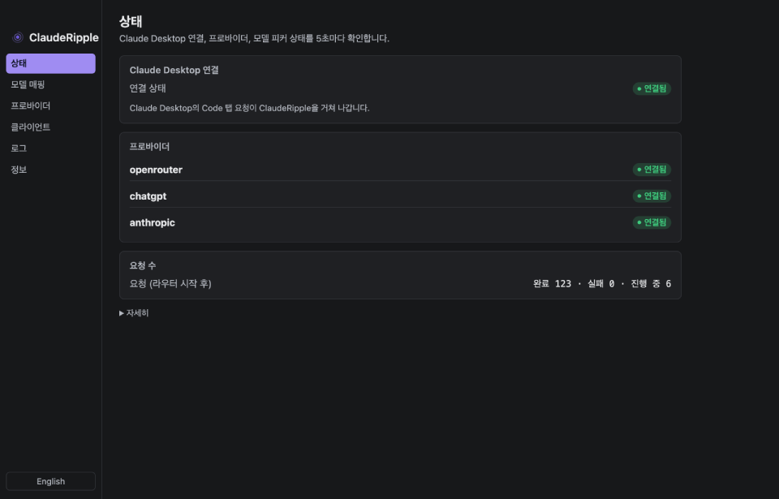
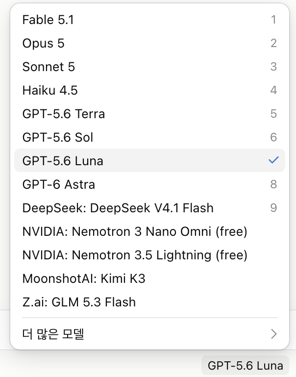
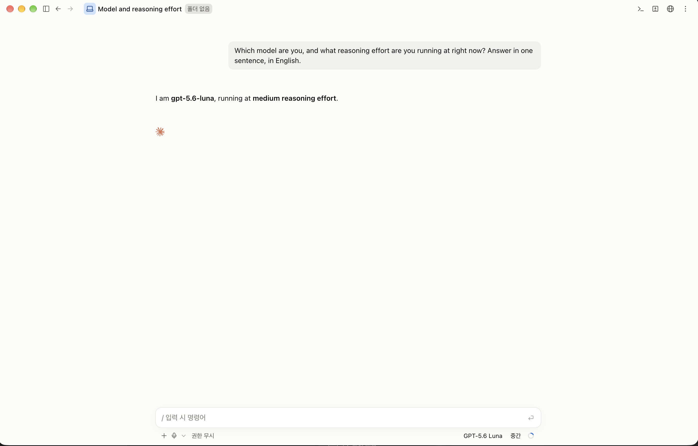
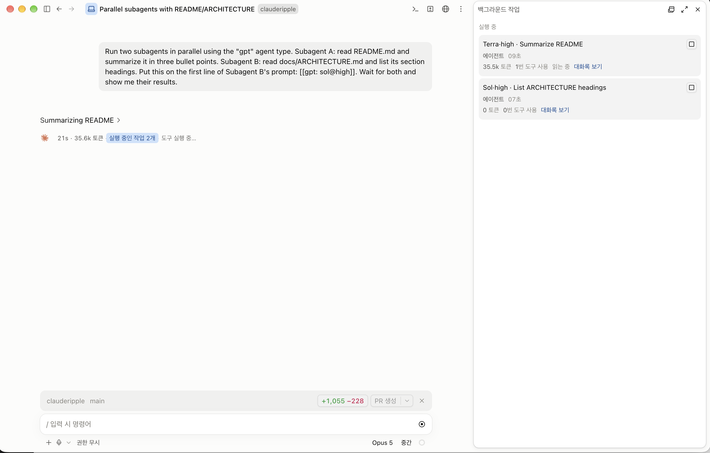
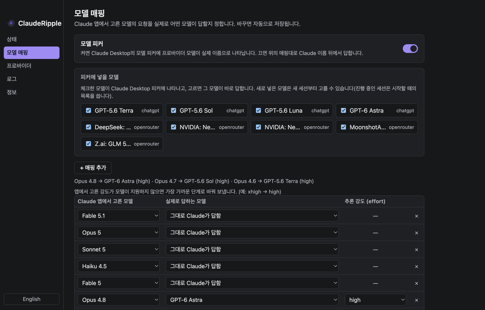
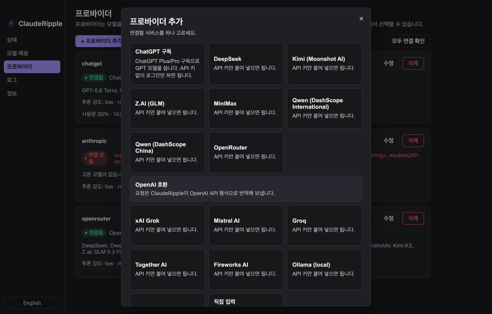

<h1 align="center">ClaudeRipple</h1>

<p align="center"><a href="README.md">English</a> · <a href="README.ko.md">한국어</a> · <a href="README.zh-CN.md">简体中文</a> · <a href="README.ja.md">日本語</a> · <a href="README.es.md">Español</a> · <b>Português (BR)</b></p>

<p align="center">
  <b>O chat continua Claude. Só o Code vira GPT.</b><br>
  A configuração do próprio Claude Desktop para outros modelos troca o <b>app inteiro</b> — o chat, o Remote
  Control pelo celular e os conectores vão junto.<br>O ClaudeRipple não desliga nada: você continua logado na sua
  assinatura do Claude enquanto GPT, DeepSeek, Kimi, Grok<br>ou mais de 400 outros modelos respondem na
  <b>aba Code</b>. E ainda leva o Claude para o <b>app Codex</b> e o <b>Codex CLI</b>.
</p>

<p align="center">
  <a href="https://www.npmjs.com/package/clauderipple"></a>
  
  <a href="LICENSE"></a>
  
  
  
  
  <a href="README.md"></a>
</p>

<p align="center">
  
</p>

<table align="center">
  <tr>
    <td align="center" width="34%"><br><sub>Modelos GPT com os nomes reais no seletor do Claude Desktop</sub></td>
    <td align="center" width="66%"><br><sub>GPT-5.6 Luna respondendo na aba Code, com o esforço que você escolheu</sub></td>
  </tr>
  <tr>
    <td colspan="2" align="center"><br><sub>Subagentes no GPT-5.6 Terra e no Sol, identificados no painel de tarefas em segundo plano</sub></td>
  </tr>
</table>

---

## 1P, não 3P: a diferença pela qual todo este projeto existe

O Claude Desktop já traz um jeito oficial de usar outros modelos — a configuração de
**gateway de inferência**, que o app chama de modo de terceiros ou **3P**. Ativá-la não é
uma escolha por sessão. Ela coloca o **app inteiro** em outro modo de implantação já na
inicialização, e esse modo é outro produto:

- A janela deixa de carregar o `claude.ai` e passa a carregar um bundle local. As chamadas
  `/api/` e `/v1/` do claude.ai respondem `custom_3p_not_available` 503.
- O "Chat" deixa de ser o chat do claude.ai. Vira uma sessão de agente local do Claude Code.
- O Remote Control e as sessões paralelas são desativados por completo
  (`shouldEnableSessionsBridge()` retorna false).
- Os conectores do claude.ai da própria Anthropic, o Claude Design, a continuidade com o
  celular e a busca nos chats vão junto.

Não existe meio-termo. "Chat no Claude, Code no gateway" é impossível para qualquer pessoa,
porque no modo 1P nada passa pelo gateway. (Tudo isso foi extraído do próprio bundle do
app; veja [docs/ARCHITECTURE.md](docs/ARCHITECTURE.md) §2.)

**O ClaudeRipple nunca mexe nessa configuração.** O app continua logado na sua assinatura
do Claude, no modo 1P, e outro modelo responde na aba Code e nos subagentes dela — com o
nome real no seletor de modelos, com o esforço de raciocínio que você escolheu. Você não troca
sua conta do Claude por uma do GPT. Fica com as duas, no mesmo app.

Continuar no 1P traz três coisas, e nenhuma ferramenta baseada em gateway consegue oferecer
qualquer uma delas:

- **Programe pelo celular, com GPT.** O Remote Control fica desligado no 3P. Aqui ele
  continua ligado, então você pode escolher um modelo, mandar uma tarefa pelo celular e ver
  os commits chegando.
- **Conectores funcionando enquanto outro modelo trabalha.** O 3P troca as chamadas ao
  claude.ai por stubs, o que derruba junto os conectores da própria Anthropic. Leia um
  documento do Google Drive e deixe o GPT escrever o código.
- **Sessões na nuvem e paralelas.** Somem no 3P. Aqui ficam intactas.

Se você paga pelo Claude, o 3P não é opção — ele joga fora metade da assinatura pela qual
você está pagando. Este é o único jeito de mantê-la e ainda escolher o modelo.

## Perguntas frequentes

### Posso usar GPT no app Claude Desktop?

Sim — na **aba Code** e nos subagentes dela. Instale o ClaudeRipple, faça login com uma
assinatura ChatGPT Plus ou Pro, e o GPT (GPT-6 Sol, Luna, Astra, GPT-5.6 Terra e os demais)
aparece com o nome real no seletor de modelos, com o esforço de raciocínio que você escolher.
O app em si não é modificado nem passa para nenhum outro modo. A aba de **chat** geral
continua Claude: nenhuma ferramenta consegue rotear o chat sem colocar o app inteiro em modo
gateway (veja [1P, não 3P](#1p-não-3p-a-diferença-pela-qual-todo-este-projeto-existe)).

### Como uso GPT no Claude Code?

A mesma instalação cobre a CLI `claude` no terminal. O ClaudeRipple é um proxy local para o
qual o Claude Code é apontado com duas linhas em `~/.claude/settings.json`; assim, suas
skills, hooks, servidores MCP, `CLAUDE.md` e subagentes continuam funcionando enquanto outro
modelo responde.

### Preciso ativar a configuração de "inferência de terceiros" (gateway) do Claude Desktop?

Não — e você não deve ativá-la. Essa configuração coloca o app inteiro no modo 3P, que deixa de carregar
o claude.ai, substitui o chat por uma sessão de agente local e desliga o Remote Control. O
ClaudeRipple nunca mexe nela.

### Vou perder o chat do claude.ai, o Remote Control ou meus conectores?

Não. O app continua logado na sua assinatura do Claude, então o chat, o Remote Control pelo
celular, as sessões na nuvem e os conectores da própria Anthropic continuam funcionando. É
justamente para isso que se fica no 1P.

### Ainda posso usar o próprio Claude?

Sim. O mapeamento de modelos é feito por nome de modelo: deixe um nome mapeado para o Claude
e ele responde como Claude. A maioria das pessoas mapeia um ou dois nomes para o GPT e deixa
o resto como está.

### Preciso de uma chave de API da OpenAI?

Não. Qualquer plano do ChatGPT que inclua o Codex serve — Plus, Pro e Business, além de
Enterprise ou Edu quando o administrador do workspace tiver ativado o Codex. Você faz login
pelo app, e nenhuma chave de API entra na história. Valem os limites de uso do plano; quando
eles se esgotam, os créditos do Codex que você comprou passam a ser usados. As chaves de API
são para os outros provedores (DeepSeek, Kimi, GLM, OpenRouter e qualquer outro com endpoint
compatível com Anthropic ou OpenAI).

### Quais modelos posso usar?

GPT por meio de uma assinatura do ChatGPT, e DeepSeek, Kimi, GLM, Grok, Qwen e mais de 400
outros pelo OpenRouter ou por uma chave de API direta. Os modelos Claude continuam
funcionando como sempre.

### Funciona no Windows?

Sim, no Windows e no macOS, em arm64 e x64. A instalação, o painel, o reinício e a desinstalação
foram medidos no Windows 11 arm64; o runtime x64 foi medido sob emulação. No Linux também
funciona, desde que haja uma sessão de usuário do systemd: a instalação, uma requisição da aba
Code passando pelo roteador, um reinício no meio de uma resposta em streaming e a
desinstalação foram medidos no Ubuntu 24.04 x64 com o Claude Desktop 2.2553.13, assim como
o modo seletor: os modelos de `cli.extraModels` aparecem no seletor da aba Code ao lado dos
modelos do próprio Claude.

### Meu código é enviado para algum outro lugar?

Não. O proxy roda na sua própria máquina. As requisições vão para o provedor que você
configurou e para mais nenhum lugar, e as credenciais ficam no seu diretório home. Veja
[Privacidade](#privacidade).

### Minha conta do Claude pode ser banida? Isso viola os termos da Anthropic?

O que o ClaudeRipple faz com o Claude é limitado e verificável: uma requisição que fica no
Claude sai da sua máquina exatamente como o Claude Code a enviou, byte por byte, e uma requisição
roteada para o GPT ou outro provedor nunca chega à Anthropic. Ele funciona pelas
configurações de proxy e de certificado que o Claude Code documenta para redes corporativas
(`HTTPS_PROXY`, `NODE_EXTRA_CA_CERTS` — [Enterprise network configuration](https://code.claude.com/docs/en/corporate-proxy)),
e não modificando o app. Os relatos de contas banidas tratam da direção oposta — um login de
assinatura do Claude usado a partir de **outro** programa. O ClaudeRipple tem um recurso
opcional desse tipo: o Claude dentro do Codex usando o login da sua assinatura. Esse uso
está sujeito aos termos da Anthropic; uma chave de API da Anthropic elimina a questão. Fazer
rodízio entre várias assinaturas do Claude também é uma decisão sua, à luz desses termos. Só
a Anthropic pode dizer como uma conta é tratada, então nada aqui é uma promessa.

### E o Gemini com uma conta do Google?

Uma chave de API do AI Studio é a opção com suporte do Google — e a segura. O login com conta
do Google (Antigravity) é diferente: os [termos do Antigravity](https://antigravity.google/terms)
do Google (seção 6) e o [FAQ do Gemini CLI](https://geminicli.com/docs/resources/faq/)
classificam como violação o uso dessas credenciais a partir de outro programa. Em fevereiro
de 2026, o Google suspendeu contas usadas dessa forma — a suspensão também cortou o acesso
ao Gemini CLI e ao Code Assist — e [afirmou](https://github.com/google-gemini/gemini-cli/discussions/20632)
que uma segunda violação resulta em suspensão permanente. O ClaudeRipple oferece esse login
porque outras ferramentas oferecem e porque houve pedidos, mostra este aviso antes de
começar e não faz nada para esconder o tráfego. Se for usar mesmo assim, use uma conta
secundária.

### Posso usar várias contas do ChatGPT?

Sim. Cada `clauderipple login` (ou **+ Adicionar conta do ChatGPT** no painel) adiciona uma.
Quando uma conta atinge o limite de uso, a mesma requisição passa para a próxima conta, e a
conta esgotada fica em espera até sua janela de uso reiniciar; uma conversa fica na conta que respondeu, para
manter o cache de prompt. Isso vale para a aba Code do Claude Desktop, para o Claude Code e
para o GPT no app e na CLI do Codex.

### Posso usar o Claude dentro do Codex?

Sim. `clauderipple codex on` adiciona o ClaudeRipple como provedor, e os modelos Claude
aparecem com os próprios nomes na lista de modelos do app e da CLI do Codex. Eles respondem
pelo seu login do Claude Code ou por uma chave de API da Anthropic. Veja
[App Codex e Codex CLI](#app-codex-e-codex-cli).

### Ele gera imagens?

Sim, com uma assinatura do ChatGPT e sem chave de API:
`clauderipple image "a red paper boat" -o boat.png --aspect square`. `--ref FILE` adiciona
uma imagem de referência, e `--transparent`, um fundo transparente. Cada imagem leva cerca
de 30 segundos, e a assinatura escolhe a resolução e a qualidade. Os subagentes que o
ClaudeRipple gera recebem essa mesma chamada nas instruções, então também conseguem criar
imagens. Veja [Claude Code](#claude-code-terminal-remote-control-subagentes).

### O GPT se sai pior dentro do Claude Code?

O prompt de sistema e as descrições de ferramentas do Claude Code foram escritos para o
Claude; outro modelo, portanto, lê instruções ajustadas para um modelo diferente e pode se
comportar um pouco diferente do que no próprio cliente. O ClaudeRipple informa a cada modelo
o próprio nome e esforço, adapta os schemas de ferramentas que um fornecedor rejeitaria e
permite acrescentar instruções por provedor. Uma configuração comum é usar o Claude como
modelo principal, com GPT ou DeepSeek como subagentes.

### Qual a diferença para o CC Switch, o opencodex ou o claude-code-router?

Veja a [tabela comparativa](#uma-ferramenta-em-vez-de-quatro). Resumindo: o ClaudeRipple
chega à aba Code do Claude **Desktop** enquanto o app continua logado no Claude, e mostra
outros modelos no seletor com os nomes reais. O CC Switch também chega ao app desktop, mas
ativando o modo gateway (3P) dele.

### É gratuito?

Sim. O ClaudeRipple é open source, sob a GPL-3.0. Você paga só pelas assinaturas ou chaves
de API que já usa.

## Uma ferramenta em vez de quatro

Ferramentas parecidas permitem que a CLI do Claude Code ou o Codex CLI usem outros modelos,
mas ou não alcançam o **app desktop** do Claude, ou só o alcançam pelo modo gateway (3P)
dele, e, no momento em que você troca de modelo, perde o lado da assinatura do Claude (chat
do claude.ai, Remote Control, sessões na nuvem). O ClaudeRipple cobre o app desktop, o
terminal e o Codex a partir de um único app na barra de menus, roda as duas assinaturas lado
a lado e mantém intacto o harness do Claude Code: suas skills, hooks, servidores MCP,
`CLAUDE.md`, subagentes e conectores do claude.ai continuam funcionando enquanto outro
modelo faz o raciocínio.

| | ClaudeRipple | CC Switch (verificado em 2026-09-24) | opencodex / openclaude (verificado em 2026-09-16) | claude-code-router | Modo gateway (3P) do Claude Desktop |
|---|---|---|---|---|---|
| Aba Code do Claude **Desktop** **sem** o modo gateway (3P) | ✅ | ❌ ² | ❌ ¹ | ❌ | ❌ por definição |
| Mantém chat do claude.ai, Remote Control, sessões na nuvem e conectores | ✅ | ❌ | ❌ | ❌ | ❌ |
| Assinaturas do Claude e do GPT lado a lado | ✅ | ❌ um provedor por vez | ❌ tudo ou nada | ❌ | ❌ |
| Nomes reais dos modelos no seletor do Desktop | ✅ | ❌ nomes de função `claude-*` ² | ❌ | ❌ | parcial |
| Várias contas do ChatGPT, trocando quando uma se esgota (Desktop e Codex) | ✅ | ❌ troca manual ³ | ✅ | ❌ | ❌ |
| CLI `claude` no terminal | ✅ | ✅ | ✅ | ✅ | ✅ |
| **App** Codex e Codex CLI → Claude | ✅ | ✅ | ✅ | ❌ | ❌ |
| Cache de prompt em provedores traduzidos | **94–99%** medido | não medido | não medido | varia | não se aplica |
| Subagentes identificados pelo modelo real no painel de tarefas | ✅ | ❌ | ❌ | ❌ | ❌ |
| Interface gráfica de configuração, sem precisar de terminal | ✅ | ✅ | ❌ | ❌ | ❌ |
| App assinado e notarizado, com runtime próprio | ✅ | ✅ | ❌ | ❌ | – |

¹ O README do opencodex mostrava o Claude Desktop em uma demo, mas não publicava passos de
configuração para ele, nem no repositório nem no site de documentação (verificado em
2026-09-16). Na época, o único caminho público para o app desktop era a configuração oficial
de gateway — a última coluna.

² O CC Switch chega ao Claude Desktop gravando o perfil de terceiros do app
(`Claude-3p/claude_desktop_config.json`, `"inferenceProvider": "gateway"`), que é a última
coluna. Pelo gateway local dele, o seletor mostra apenas os nomes de função `claude-sonnet-*`,
`claude-opus-*` e `claude-haiku-*` ([manual do CC Switch](https://github.com/farion1231/cc-switch/blob/main/docs/user-manual/en/2-providers/2.6-claude-desktop.md)).
O CC Switch gerencia mais ferramentas do que esta tabela cobre (Gemini CLI, OpenCode e
outras) e sincroniza servidores MCP e skills entre elas.

³ Cada conta do ChatGPT fica vinculada ao próprio card de provedor, e os cards oficiais do
ChatGPT ficam fora da fila de failover (notas de versão da v3.20.0).

A configuração de "inferência de terceiros" do próprio app desktop joga o app inteiro em
outro modo: você perde o chat do claude.ai, o Remote Control e as sessões na nuvem.
Ferramentas que substituem `ANTHROPIC_BASE_URL` nunca chegam ao app desktop, e as que chegam
gravam essa mesma configuração. O ClaudeRipple, por sua vez, é um
pequeno proxy HTTPS em que só o processo do Claude Code confia: as requisições dos modelos
que você mapeia vão para o seu provedor, e todo o resto vai para a Anthropic byte a byte.

## O que você ganha

- **Qualquer modelo no Claude Desktop e no Claude Code.** GPT-6 Sol / Luna / Astra e
  GPT-5.6 Terra / Sol / Luna pela sua assinatura ChatGPT Plus/Pro (modelos novos aparecem
  no mesmo dia em que a OpenAI os disponibiliza), Google Gemini, ou DeepSeek, Kimi, GLM,
  MiniMax, Qwen, Grok, Mistral, Groq, Together, Fireworks, OpenRouter (mais de 400 modelos)
  e Ollama / LM Studio locais. Com os nomes reais no seletor, ou mapeados para um nome do
  Claude.
- **Claude no app Codex e no Codex CLI.** Um endpoint local compatível com OpenAI que o
  Codex trata como provedor; os modelos Claude aparecem na própria lista de modelos do
  Codex. Usa seu login atual do Claude Code ou uma chave de API da Anthropic.
- **Várias contas do Claude sem quebrar o cache de prompt.** Ative o rodízio de contas em um
  provedor Claude nativo, adicione assinaturas pelo painel, e cada conversa fica na conta
  que respondeu. Antes de a resposta começar, uma recusa por cota ou por autenticação passa
  aquele turno para a próxima conta. Esse caminho nativo do Claude Desktop/Code é separado
  da entrada traduzida do Codex, que escolhe um login disponível e não faz rodízio de contas.
- **Várias contas do ChatGPT.** Cada `clauderipple login` (ou **+ Adicionar conta do ChatGPT**
  no painel) adiciona uma. Quando uma conta atinge o limite, a próxima assume a mesma
  requisição, e a conta esgotada fica em espera até sua janela de uso reiniciar; uma conversa fica na conta que
  respondeu, para manter o cache. Isso cobre a aba Code e os subagentes do Claude Desktop
  **e o GPT no app e na CLI do Codex** — o Codex mantém o próprio login e passa para a
  próxima conta sem precisar sair.
- **O harness completo do Claude Code, intacto.** Skills, hooks, MCP, `CLAUDE.md`,
  subagentes, plan mode, Remote Control no celular: nada é desligado.
- **Correto por construção.** Cache de prompt preservado (breakpoints de cache da Anthropic
  e prefixos estáveis da OpenAI), threads do lado do servidor do Claude Code tratadas,
  chamadas de ferramentas e imagens preservadas na ida e na volta, esforço de raciocínio
  limitado ao que cada modelo aceita, campos exclusivos da Anthropic removidos para
  fornecedores compatíveis.
- **Um log de requisições de verdade.** Quem pediu, qual modelo respondeu, tokens de
  entrada / em cache / de saída, latência e status de cada requisição, com um resumo da
  última hora.
- **Identificação dos subagentes.** O painel de tarefas em segundo plano mostra
  `Terra·high · Review` em vez de um "Agent" genérico.
- **A rota, onde você digita.** Um mod do Claude Code coloca uma linha acima do prompt:
  para onde foi sua última requisição, o esforço, o acerto de cache e o tempo. `Log` (ou
  `/ripple-log`) abre o log de requisições em um painel lateral, com cores por provedor e
  por resultado; `×` (ou `/ripple-bar`) oculta a linha. O mesmo mod mantém um worker no
  próprio modelo quando a chamada do Agent indica outro, e lê o marcador
  `[[ripple: name@level]]` dele onde quer que esteja no prompt. Basta um botão na tela
  **Clientes**, ou `clauderipple mod on`.
- **Imagens pela sua assinatura do ChatGPT.** `clauderipple image "<prompt>"`, com imagens
  de referência e fundos transparentes. Os subagentes recebem instruções de como fazer,
  então um worker GPT ou DeepSeek consegue criar uma imagem e olhar para ela sem uma
  ferramenta de imagem.
- **Workers enxutos, se você quiser.** Um único botão faz com que os subagentes gerados
  recebam só as ferramentas que um worker usa, em vez de todos os servidores MCP e plugins
  da sessão: a primeira requisição de um worker caiu de 33k para 9k tokens.
- **Feito para quem não quer saber de terminal.** Presets de provedores com teste de conexão
  em um clique e descoberta de modelos, mapeamento de modelos em menus suspensos, salvamento
  automático, interface em coreano e inglês. Um app de barra de menus que traz o próprio
  runtime e se configura sozinho na primeira execução. Assinado e notarizado.

<p align="center">
  
</p>

## Instalação

**macOS**

```sh
curl -fsSL https://raw.githubusercontent.com/PBJ-2/clauderipple/main/scripts/install.sh | sh
```

**Windows** (PowerShell)

```powershell
irm https://raw.githubusercontent.com/PBJ-2/clauderipple/main/scripts/install.ps1 | iex
```

**Linux** (uma sessão desktop com systemd)

```sh
curl -fsSL https://raw.githubusercontent.com/PBJ-2/clauderipple/main/scripts/install.sh | sh
```

O roteador roda como um serviço systemd por usuário: `systemctl --user status clauderipple`,
e `journalctl --user -u clauderipple` para ver o que ele registrou. O modo seletor registra a
CA local como confiável no banco de dados NSS que o Chromium lê (`~/.pki/nssdb`, só para o
seu usuário, sem sudo), o que exige o `certutil`: rode `sudo apt install libnss3-tools`
(Fedora: `sudo dnf install nss-tools`) antes de `clauderipple picker on`.

Esses são todos os pré-requisitos. O script usa um Node 24+ que você já tenha e, se não houver
nenhum, baixa o build oficial para `~/.clauderipple/runtime`, conferindo-o com o checksum
publicado pelo nodejs.org. Depois, configura o ClaudeRipple: um certificado local, duas
linhas em `~/.claude/settings.json` e um roteador em segundo plano que inicia junto com o
computador. Sem direitos de administrador, sem senha.

Com o Node já instalado, você pode pular o script:

```sh
npm install -g clauderipple
clauderipple install
```

Depois, abra o painel e adicione um provedor:

```sh
clauderipple ui
```

**Provedores** → adicione o ChatGPT ou cole uma chave de API → **Mapeamento de modelos**.

**O app da barra de menus / bandeja** é opcional. Ele mostra o estado do roteador e abre o
painel com um clique:

```sh
clauderipple tray
```

Ele roda em Electron, que tem cerca de 270 MB e, por isso, não é instalado por padrão.
`clauderipple tray --install` baixa o Electron uma única vez; todo o resto funciona sem ele.

**Atualização.** A bandeja oferece a nova versão quando houver uma (**Verificar atualizações…**), ou:

```sh
clauderipple update
```

A atualização segue o jeito como você instalou — o script de instalação de novo, ou o npm — e
reinicia o roteador na nova versão. O Electron da bandeja é mantido entre atualizações.

Opcional, para ver os nomes reais no seletor do Desktop: **Clientes → Claude Desktop →
Seletor de modelos → Ativar seletor**; depois, encerre o Claude Desktop e abra-o de novo. Para
confiar no certificado local só para o seu usuário, o macOS pede sua senha de login e o
Windows mostra uma caixa de confirmação com a impressão digital do certificado; o Linux o
adiciona ao seu banco NSS sem perguntar. O ClaudeRipple nunca vê nenhuma senha, e nenhuma
plataforma exige direitos de administrador.

> **Fechar a janela do Claude Desktop não basta.** Ele continua rodando, e a próxima
> abertura reaproveita esse processo sem ler a nova configuração. Encerre-o de verdade
> (macOS: ⌘Q; Windows: pelo ícone da bandeja ou pelo Gerenciador de Tarefas; Linux: Ctrl+Q ou
> o ícone da bandeja, até `pgrep -f claude-desktop` não imprimir nada), senão o seletor
> simplesmente não muda, sem nenhum aviso.

<details>
<summary>A partir do código-fonte (Node 24)</summary>

```bash
git clone https://github.com/PBJ-2/clauderipple && cd clauderipple && npm install
node packages/cli/src/index.ts install   # certs, settings.json env, supervisor (launchd / Task Scheduler), end-to-end probe
node packages/cli/src/index.ts ui        # open the local GUI in your browser
```

`uninstall` desfaz tudo e restaura `~/.claude/settings.json` a partir de um backup.
Outros comandos: `status`, `start`, `stop`, `restart`, `logs -f`, `login`, `logout`,
`claude-login`, `claude-logout`, `picker on|off`, `agent-title on|off`, `mod on|off`,
`codex on|off`, `update`, `image "<prompt>"`.
</details>

## Clientes

### Claude Desktop

Funciona logo após a instalação. Mapeie modelos em **Mapeamento de modelos** (salva
automaticamente) ou ative o **modo seletor** para ver os modelos dos provedores pelo nome no
próprio seletor do app. O esforço escolhido no app é repassado; níveis não suportados são
trocados pelo mais próximo.

### Claude Code (terminal, Remote Control, subagentes)

Mesmo roteador, mesmo mapeamento. `/model gpt-5.6-terra` lista os modelos que você adicionou.
Os subagentes seguem o roteamento; um marcador `[[gpt: sol@xhigh]]` no prompt de um subagente
substitui o modelo naquela chamada, e o painel de tarefas mostra o nome real do modelo.

**Você não precisa montar um harness de agentes para isso.** Aponte o slot de subagente para
um modelo roteado e todos os subagentes passam a rodar nele — sem arquivo de agente, sem mais
nada:

```jsonc
// Settings → CLI models, or "cli": { "models": { … } } in the config
{ "subagent": "gpt-5.6-terra" }   // → CLAUDE_CODE_SUBAGENT_MODEL
```

**Todo modelo que você marca também vira um subagente nomeado.** O roteador grava
`~/.claude/agents/<name>.md` para cada modelo oferecido por exatamente um provedor
(`gpt-5.6-terra` → `gpt-5-6-terra`, `deepseek-v4.1-flash` → `deepseek-v4-1-flash`); assim,
"manda o DeepSeek fazer" não exige nada além de marcar o modelo: a ferramenta Agent o lista,
`subagent_type: "deepseek-v4-1-flash"` o executa e o painel de tarefas mostra o nome dele.
Desmarque o modelo e o arquivo dele some. O roteador só mexe nos arquivos que ele mesmo
gravou (registrados em `generated-agents.json`); um arquivo de agente que você mesmo escreveu
com o mesmo nome tem prioridade e não é tocado, então um briefing personalizado continua
sendo só o arquivo de agente do próprio Claude Code, com um `model:` que o roteador conhece:

```markdown
---
name: reviewer
description: Independent review on GPT-5.6 Sol.
model: gpt-5.6-sol@medium
---
You are the reviewer for this session. Verify the change yourself and report
the conclusion only.
```

O esforço por chamada vai na **primeira linha** do prompt do subagente:
`[[ripple: gpt-5-6-terra@high]]` — qualquer nome de agente ou id de modelo funciona ali. Um
marcador em qualquer outro lugar é texto comum e é ignorado (um resumo de compactação que
cite um marcador não pode redirecionar a sessão). Um modelo que o roteador não sabe para onde
mandar é recusado pelo nome (`400 ClaudeRipple: no provider declares "…"`), em vez de ser
repassado para falhar em outro lugar de forma menos clara; os modelos nativos do Claude
sempre passam direto. Defina `"cli": { "agentFiles": false }` para desligar a geração.

Por padrão, um worker gerado herda todas as ferramentas da sessão, então todos os servidores MCP e
plugins são incluídos em cada requisição de worker. `"cli": {
"limitWorkerTools": true }` (ou **Ferramentas dos workers** no painel) dá a ele só as
ferramentas de leitura, edição, execução, busca e skills, o que reduziu a primeira
requisição de um worker de cerca de 33k para 9k tokens. Um worker assim não tem ferramentas
de navegador nem de simulador. Um worker que precise delas deve ser definido em um arquivo de agente
seu, que nunca é tocado.

Com um provedor ChatGPT configurado, as imagens vêm da mesma assinatura:

```bash
clauderipple image "a red paper boat, flat illustration" -o boat.png --aspect square
```

`--transparent`, `--format png|jpeg|webp` e `--ref FILE` (uma imagem de referência, pode
ser repetido) são opcionais. Cada imagem leva cerca de 30 segundos. O backend da assinatura
escolhe a resolução e a qualidade por conta própria, então a proporção é solicitada em palavras
(`--aspect`). O comando é um cliente de `POST /api/image` na porta de administração, que
responde com os bytes da imagem. Os workers gerados recebem a forma `curl` dessa chamada,
então um worker que só tem Bash consegue criar uma imagem e lê-la de volta.

O Claude Code executa o `WebSearch` como uma requisição separada a um modelo pequeno. Para
que uma configuração roteada para o ChatGPT não gaste cota da Anthropic nessa requisição,
selecione o mesmo provedor ChatGPT como backend de busca em `config.json`:

```jsonc
{ "webSearch": { "provider": "chatgpt", "model": "gpt-5.6-terra" } }
```

Isso é opcional. Sem a configuração `webSearch`, o caminho de busca atual do Claude Code
continua o mesmo.

### App Codex e Codex CLI

```bash
clauderipple codex on     # adds a "clauderipple" provider to ~/.codex/config.toml (backup first)
codex --profile clauderipple -m claude-sonnet-5
```

`codex on` também aponta o provedor OpenAI embutido do Codex para o ClaudeRipple (`openai_base_url`).
O Codex mantém o login do ChatGPT; as requisições GPT dele seguem para o ChatGPT sem alteração,
exceto pela conta, que é escolhida entre as adicionadas ao ClaudeRipple — então, com várias
adicionadas, o Codex também passa de uma conta esgotada para a próxima. Sem nenhuma adicionada,
ou com todas no limite, é usado o login do próprio Codex. Um `openai_base_url` que você mesmo
definiu é deixado como está. `clauderipple codex off` desfaz a alteração.

Os modelos Claude aparecem com os próprios nomes na lista de modelos do Codex (o ClaudeRipple
grava um catálogo de modelos ao lado do catálogo do próprio Codex). O Claude é acessado pelo
seu login do Claude Code (detectado na sessão do Desktop em execução, no login do terminal ou
em um login próprio do ClaudeRipple: **Provedores → Claude (Anthropic) → + Adicionar conta do Claude**
abre o navegador, sem precisar de terminal; equivale a
`clauderipple claude-login`) ou por uma chave de API da Anthropic. Reutilizar o login de uma
assinatura está sujeito aos termos da Anthropic. Qualquer provedor compatível com Anthropic
que você tenha configurado fica disponível da mesma forma.

<p align="center">
  
</p>

## Provedores

| Provedor | Tipo | Autenticação | Lista de modelos | Observações |
|---|---|---|---|---|
| Assinatura do ChatGPT | backend do Codex | vários logins, trocando quando um se esgota (o login do Codex também é reaproveitado) | lida da sua assinatura (GPT-6 Sol, Luna, Astra, GPT-5.6 …) | esforço low…max (Luna: ultra), cache de prompt 94–99% |
| Google Gemini | API Gemini | chave de API do AI Studio, ou login com conta do Google (Antigravity, veja as Perguntas frequentes) | descoberta automática | traduzido (Messages ⇄ generateContent), thought signatures mantidas entre turnos |
| OpenRouter | compatível com Anthropic | chave de API | mais de 400, descoberta automática | suporte a esforço por modelo lido da API |
| DeepSeek, Kimi, Z.ai GLM, MiniMax, Qwen (intl / cn) | compatível com Anthropic | chave de API | preset | conferido com a documentação do fornecedor |
| xAI Grok, Mistral, Groq, Together, Fireworks | compatível com OpenAI | chave de API | descoberta automática | traduzido (Chat Completions / Responses) |
| Ollama, LM Studio | compatível com OpenAI, local | nenhuma | descoberta automática | |
| Anthropic | nativo | login(s) do Claude ou chave de API | modelos Claude | rodízio opcional, com a conversa fixa na conta, para Claude Desktop/Code; o Codex escolhe um login |
| Qualquer outro | personalizado | à sua escolha | descoberta automática | qualquer endpoint compatível com Anthropic ou OpenAI |

As requisições para provedores compatíveis são limpas dos campos exclusivos da Anthropic
(threads do lado do servidor, ferramentas diferidas, gerenciamento de contexto, vínculos de
thinking), e o esforço é limitado por modelo, para que os fornecedores não respondam 400 ao
formato de requisição do Claude Code.

## Como funciona

```
Claude Desktop / claude CLI ──HTTPS_PROXY──▶ ClaudeRipple ──▶ api.anthropic.com   (unchanged)
                                               │
                        mapped model ──────────┼──▶ chatgpt.com/backend-api (Responses ⇄ Messages)
                                               ├──▶ Anthropic-compatible vendors (+ compat layer)
                                               ├──▶ OpenAI-compatible vendors (Messages ⇄ Chat/Responses)
                                               └──▶ Google Gemini (Messages ⇄ generateContent)
Codex app / CLI ──/v1/responses──▶ ClaudeRipple ingress ──▶ Claude (your login or API key) / vendors
```

- A CLI do Claude Code lê `HTTPS_PROXY` e `NODE_EXTRA_CA_CERTS` de
  `~/.claude/settings.json` (o caminho de proxy corporativo documentado pela Anthropic). Só
  esse processo confia na CA local do ClaudeRipple; o armazenamento de certificados do sistema operacional não é
  tocado, a menos que você ative o modo seletor.
- O modo seletor faz o próprio tráfego do app para o claude.ai passar pelo proxy e adiciona
  seus modelos à lista do seletor que o app busca ao iniciar. Para desligar, basta um clique.
- Ao reiniciar, o roteador espera as chamadas em andamento terminarem; ele se encerra sozinho
  após falhas repetidas no upstream para que o launchd o reinicie, rotaciona os logs e nunca
  descarta uma requisição em silêncio.

Detalhes, com as fontes: [docs/ARCHITECTURE.md](docs/ARCHITECTURE.md).

## Privacidade

Tudo roda em 127.0.0.1. As chaves de API ficam em `~/.clauderipple/config.json`, e as
autorizações OAuth do Claude adicionadas, em `~/.clauderipple/claude-accounts.json` (ambos
com permissão 0600). As APIs de administração e os logs não expõem nem tokens nem ids de
conta do upstream. Os únicos destinos de rede são os provedores que você configura. Não há
telemetria.

## Status: alfa

Em uso diário pelo autor, mas ainda jovem. Espere algumas arestas:

- **O suporte a Windows é novo (2026-09-14).** Instalação, configuração, o roteador, o login,
  o seletor e uma chamada real ao GPT foram verificados em hardware x64; a recuperação após
  falhas, em arm64. A janela ainda usa a barra de título padrão do Windows. Os builds para
  Windows não são assinados; veja a observação em Instalação.
- **O suporte a Linux é novo (2026-09-24)**, uma contribuição acompanhada de medições no
  Ubuntu 24.04 x64 (instalação, uma requisição da aba Code, reinício no meio do streaming,
  modo seletor, desinstalação). Exige uma sessão de usuário do systemd; outras distribuições
  e arm64 não foram testados.
- ChatGPT, OpenRouter e Claude no Codex foram verificados com contas reais; os outros presets
  seguem a documentação oficial dos fornecedores.
- Um modelo adicionado ao seletor fica disponível a partir da sessão seguinte.
- O Claude Code e o Codex mudam os protocolos com frequência; uma atualização de cliente
  pode quebrar uma tradução até o ClaudeRipple se ajustar. Relatos de bugs e logs são
  bem-vindos.

## Sem afiliação

O ClaudeRipple é um projeto open source independente. Não tem afiliação com a Anthropic nem
com a OpenAI, nem é endossado ou patrocinado por nenhuma delas. Claude e Claude Code são
marcas comerciais da Anthropic, PBC. ChatGPT e Codex são marcas comerciais da OpenAI.

## Licença

Copyright (c) 2026 pbj. GPL-3.0 — veja [LICENSE](LICENSE). Use à vontade; se você distribuir
uma versão modificada, distribua também o código-fonte dela sob a mesma licença.
